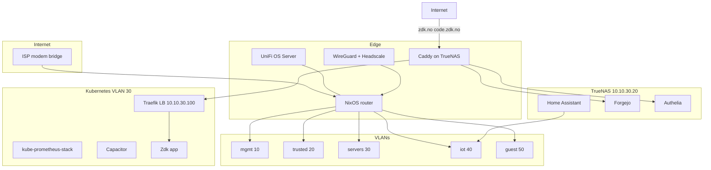
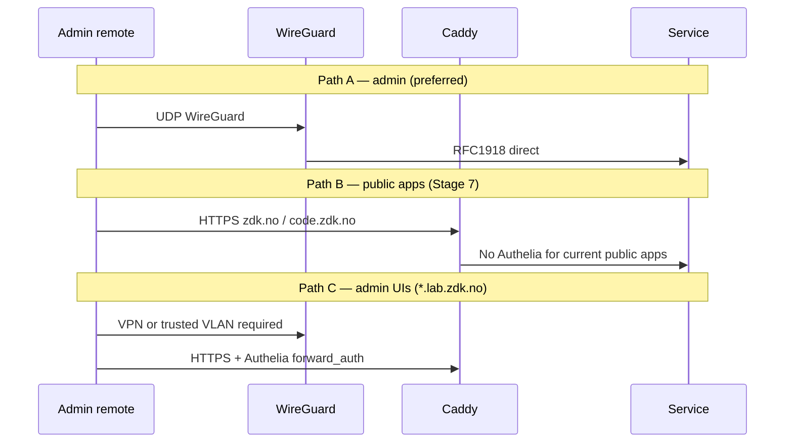
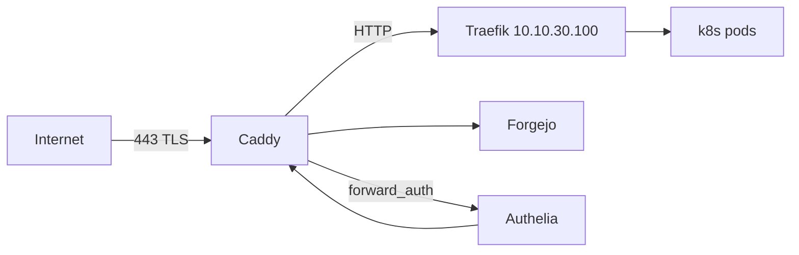

# Architecture

Diagrams and traffic flows. Decisions: [decisions.md](decisions.md). VLANs: [vlan-plan.md](vlan-plan.md).

## System overview



**Principle:** The router is the **policy enforcement point**. DNS, proxy, monitoring, and apps run on hosts in defined VLANs, configured from Git. UniFi OS Server is an intentional exception on the OptiPlex (WiFi control plane next to L2).

## Service map

| Service | Host | Deploy |
|---------|------|--------|
| Firewall, DHCP, Unbound, WireGuard, DNSUpdater | NixOS router (OptiPlex) | `router/` flake |
| UniFi OS Server | NixOS router (OptiPlex) | Official installer + Podman (see Stage 2) |
| Caddy, HA, Forgejo, Authelia, Blocky | TrueNAS `10.10.30.20` | `services/truenas/docker-compose.yml` |
| k3s, Traefik, Flux, Capacitor, monitoring | RK1 cluster | `nodes/` + `k8s/` |
| Zdk app | k8s (when ready) | Flux `GitRepository` + `Kustomization` → [Zdk repo](https://github.com/sknutsen/Zdk); `net/` ingress stub at `k8s/clusters/homelab/apps/zdk/` |

## External access

**Default:** VPN-first (WireGuard + Headscale). Publish minimum on WAN.



### Two-tier reverse proxy

| Tier | Role | Host |
|------|------|------|
| **Caddy** (edge) | WAN TLS, ACME, Authelia, static backends | TrueNAS Docker |
| **Traefik** (in-cluster) | Dynamic pod routing, IngressRoute | k8s MetalLB `10.10.30.100` |



- Caddy terminates public TLS; Traefik serves HTTP internally (mTLS non-goal for v1).
- All WAN traffic enters via Caddy only — no direct WAN → Traefik or k8s nodes.
- Future public apps **may** use Authelia; `zdk.no` and `code.zdk.no` do not today.

## Public services

See [decisions.md § Exposure matrix](decisions.md#exposure-matrix). Canonical Caddyfile in repo: `services/caddy/Caddyfile`.

| Hostname | Backend | Auth |
|----------|---------|------|
| `zdk.no` | Traefik `10.10.30.100:80` | None |
| `code.zdk.no` | Forgejo `:3000` | Forgejo-native |
| `capacitor.lab.zdk.no` | Capacitor Service | Authelia |
| `grafana.lab.zdk.no` | Grafana (k8s) | Authelia |

## VPN

- **WireGuard** on router — primary remote access.
- **Headscale** deployed alongside WireGuard for mesh/overlay (self-hosted control plane).
- VPN pool `10.10.255.0/24`; routes to `10.10.0.0/16` and lab IPv6 subnets when enabled.

## Monitoring and logging

| Component | Location |
|-----------|----------|
| Prometheus, Grafana, Alertmanager, Loki | k8s — `kube-prometheus-stack` |
| node_exporter | Router + each Linux host |
| TrueNAS Docker logs | Promtail sidecar/agent → Loki in k8s |

**TrueNAS log options:** (a) Promtail container in compose shipping to Loki; (b) Vector agent on TrueNAS host; (c) syslog forward to Loki gateway. Recommended: **Promtail in compose** for Caddy/HA/Forgejo containers. UniFi OS Server logs stay on the router (`journalctl` / UniFi UI) unless forwarded later.

## DDNS

[DNSUpdater](https://github.com/sknutsen/DNSUpdater) on router via systemd timer → Domeneshop. Updates `@` and `code` records only. Run before Stage 7 WAN enable.

## Declarative repo layout

```
net/
├── docs/           # plans, vlan, firewall, inventory, reference
├── router/         # NixOS flake (OptiPlex)
├── nodes/          # NixOS flake (RK1 cluster)
├── services/       # Caddy, truenas compose, dns, authelia, dnsupdater
├── k8s/            # Flux bootstrap, infrastructure, apps/zdk
├── secrets/        # sops/age encrypted
└── scripts/        # validate.sh
```

Full tree: see [plan.md](plan.md#repo-layout).
