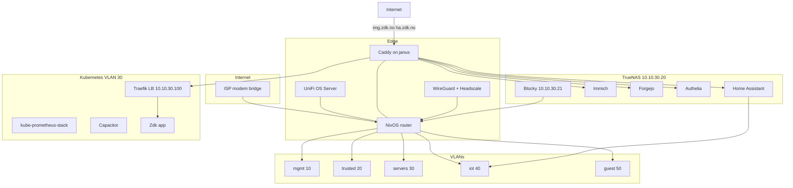
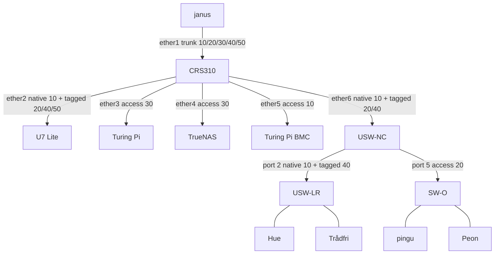
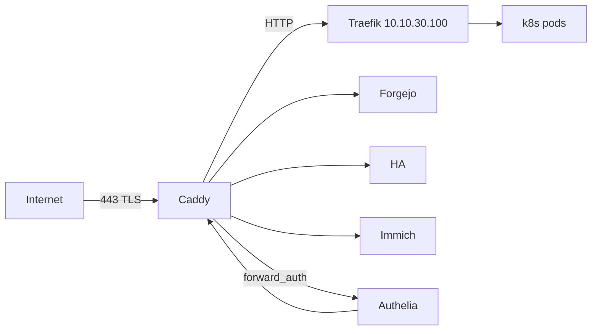

# Architecture

Diagrams and traffic flows. Decisions: [decisions.md](decisions.md). VLANs: [vlan-plan.md](vlan-plan.md).

## System overview



**Principle:** The router is the **policy enforcement point** and the **always-on edge box**: nftables plus Unbound, dnsmasq, Caddy, UniFi OS Server, Headscale, and DNSUpdater. Blocky, HA, Immich, Forgejo, Authelia, and k8s stay on VLAN hosts.

## Physical L2



USW-NC (closet) uplinks on its port 4. USW-LR (living room) uplinks on port 1. SW-O is unmanaged, so every office drop is VLAN 20. Mgmt IPs: CRS310 `10.10.10.2`, USW-NC `10.10.10.3`, USW-LR `10.10.10.4`, Turing Pi BMC `10.10.10.5`. Port tables: [vlan-plan.md](vlan-plan.md).

## Service map

| Service | Host | Deploy |
|---------|------|--------|
| Firewall, DHCP, Unbound, Caddy, WireGuard, Headscale (`127.0.0.1:8081`), DNSUpdater | NixOS router (janus) | `router/` flake + `services/caddy/Caddyfile` |
| UniFi OS Server | NixOS router (janus) | **Functional** — vendor binaries + `unifi.nix` (rootless Podman, systemd `uosserver`); data `/var/lib/unifi-os-server` |
| HA, Immich, Authelia | TrueNAS `10.10.30.20` | TrueNAS Apps (`:30103`, `:30041`, `:9091`) |
| Forgejo, Blocky, Promtail | TrueNAS `10.10.30.20` | `services/truenas/docker-compose.yml` |
| k3s, Traefik, Flux, Capacitor, monitoring | RK1 cluster | `nodes/` flake + `k8s/` Flux tree |
| Zdk app | k8s (when ready) | Flux `GitRepository` + `Kustomization` → [Zdk repo](https://github.com/sknutsen/Zdk); `net/` stub at `k8s/clusters/homelab/apps/zdk/ingressroute.yaml` |

## External access

**Default:** VPN-first (WireGuard + Headscale). Publish minimum on WAN.


### Two-tier reverse proxy

| Tier | Role | Host |
|------|------|------|
| **Caddy** (edge) | WAN TLS, ACME DNS-01 (Domeneshop; public resolvers for propagation), Authelia, static backends | janus (NixOS) |
| **Traefik** (in-cluster) | Dynamic pod routing, IngressRoute | k8s MetalLB `10.10.30.100` |



- Caddy terminates public TLS; Traefik serves HTTP internally (mTLS non-goal for v1).
- All WAN traffic enters via Caddy only — no direct WAN → Traefik or k8s nodes.
- Future public apps **may** use Authelia; `img.zdk.no`, `ha.zdk.no`, `zdk.no`, and `code.zdk.no` do not (native app login).

## Public services

See [decisions.md § Exposure matrix](decisions.md#exposure-matrix). Canonical Caddyfile in repo: `services/caddy/Caddyfile`.

| Hostname | Backend | Auth |
|----------|---------|------|
| `zdk.no` | Traefik `10.10.30.100:80` | None (vhost commented) |
| `code.zdk.no` | Forgejo `:3000` | Forgejo-native (vhost commented) |
| `img.zdk.no` | Immich `:30041` | Immich-native |
| `ha.zdk.no` | HA `:30103` | HA-native |
| `auth.lab.zdk.no` | Authelia TrueNAS App `:9091` | None (portal) |
| `truenas.lab.zdk.no` | TrueNAS `:443` | TrueNAS-native |
| `code.lab.zdk.no` | Forgejo `:3000` | Forgejo-native |
| `ha.lab.zdk.no` | HA `:30103` | HA-native |
| `immich.lab.zdk.no` | Immich `:30041` | Immich-native |
| `headscale.lab.zdk.no` | `127.0.0.1:8081` | Headscale-native (Stage 6) |
| `unifi.lab.zdk.no` | UniFi `:11443` | UniFi-native (Caddy proxy) |
| `capacitor.lab.zdk.no` | Capacitor Service | Authelia |
| `grafana.lab.zdk.no` | Grafana (k8s) | Authelia |

## VPN

- **WireGuard** on janus (`51820/udp`) — primary remote access.
- **Headscale** on janus **`127.0.0.1:8081`** (Stage 6). UniFi Inform owns `:8080`. Caddy `headscale.lab.zdk.no`, no Authelia.
- VPN pool `10.10.255.0/24`; routes to `10.10.0.0/16` and lab IPv6 subnets when enabled.

## Monitoring and logging

| Component | Location |
|-----------|----------|
| Prometheus, Grafana, Alertmanager, Loki | k8s — `kube-prometheus-stack` |
| node_exporter | Router + each Linux host |
| TrueNAS Docker logs | Promtail sidecar/agent → Loki in k8s |

**TrueNAS log options:** (a) Promtail in compose shipping to Loki (HA/Immich/Authelia Apps + Forgejo/Blocky); (b) Vector agent on TrueNAS host. **Caddy logs** are on janus (`journalctl -u caddy`). UniFi OS Server logs stay on the router unless forwarded later.

## DDNS

[DNSUpdater](https://github.com/sknutsen/DNSUpdater) on router via systemd timer → Domeneshop. Updates `@`, `code`, `img`, and `ha`. Packaging lives in the DNSUpdater repo; this flake stays a placeholder until that ships. Run before Stage 7 WAN enable.

## Target repo layout

`nodes/` is scaffolded (k3s off). `k8s/` has the Flux tree (bootstrap still
Stage 5). See [plan.md § Target repo layout](plan.md#target-repo-layout).

```
net/
├── docs/           # exists
├── router/         # exists
├── nodes/          # RK1 flake (k3s off until Stage 5)
├── switch/         # exists
├── services/       # exists (no dnsupdater dir — Nix stub)
├── k8s/            # Flux infra + Zdk stub
├── secrets/        # examples; live yaml not committed
└── scripts/        # validate.sh, generate-viewer.py
```
