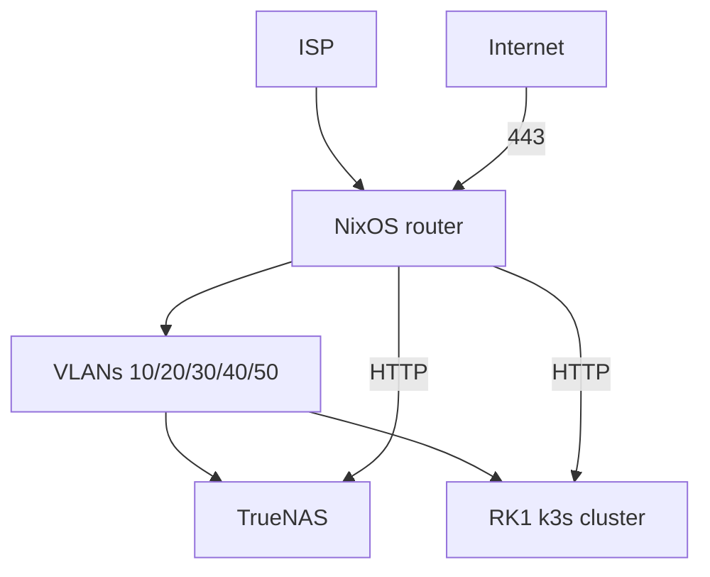

# Home network plan

Declarative homelab: NixOS router, VLAN segmentation, TrueNAS edge, k3s on Turing RK1, minimal public exposure.

## Documentation map

| Doc | Purpose |
|-----|---------|
| [decisions.md](decisions.md) | **Canonical decision log** |
| [vlan-plan.md](vlan-plan.md) | VLANs, IPs, DHCP, DNS, IPv6 |
| [firewall-matrix.md](firewall-matrix.md) | nftables policy |
| [inventory.md](inventory.md) | Devices, ports, reservations |
| [architecture.md](architecture.md) | Diagrams, traffic flows, service map |
| [implementation-stages.md](implementation-stages.md) | Stage 0–8 checklists |
| [decision-briefs.md](decision-briefs.md) | Design options and history (**brief IDs are canonical**) |
| [../router/OPEN-QUESTIONS.md](../router/OPEN-QUESTIONS.md) | Unanswered first-boot leftovers only |
| [reference/](reference/) | Alternatives not chosen |
| [plans/rk1-bsp-fork.md](plans/rk1-bsp-fork.md) | Deferred NPU/GPU kernel work |

## Principles

- Self-hosted first — no Cloudflare, Tailscale SaaS, or tunnel vendors unless unavoidable.
- Router is the policy point **and** always-on edge (Caddy, Unbound, UniFi, Headscale); config lives in Git.
- VPN-first admin (WireGuard + Headscale); publish `img.zdk.no` and `ha.zdk.no` on WAN. `zdk.no` / `code.zdk.no` when those apps are ready. `*.lab.zdk.no` stays internal.
- `*.lab.zdk.no` is internal-only. Authelia on lab UIs except `auth` /
  `code.lab` / `headscale.lab` / `ha.lab` / `immich.lab` / `truenas.lab` /
  `unifi.lab`.

## Decisions (summary)

Full table: **[decisions.md](decisions.md)**.

| Layer | Choice |
|-------|--------|
| Router | NixOS on Dell OptiPlex 9020 MT + i350-T2 (acquired); UniFi OS Server (functional) |
| Switch / WiFi | CRS310 + 2× USW Flex Mini + U7 Lite + PoE injector (all acquired); UPS deferred |
| Edge | Caddy on janus; HA, Immich, Authelia as TrueNAS Apps; Forgejo on TrueNAS |
| K8s | 4× RK1, NixOS, k3s, Flux, Traefik, Capacitor |
| Monitoring | kube-prometheus-stack in k8s (incl. Loki) |
| Public | `img.zdk.no` (Immich), `ha.zdk.no` (HA) — no Authelia; `zdk.no` / `code.zdk.no` later |

## Architecture overview



Detail: [architecture.md](architecture.md).

## Network summary

| VLAN | Name | Subnet |
|------|------|--------|
| 10 | mgmt | `10.10.10.0/24` |
| 20 | trusted | `10.10.20.0/24` |
| 30 | servers | `10.10.30.0/24` |
| 40 | iot | `10.10.40.0/24` |
| 50 | guest | `10.10.50.0/24` |

IPs, DHCP, DNS, mDNS: [vlan-plan.md](vlan-plan.md). Firewall: [firewall-matrix.md](firewall-matrix.md).

## Service map

| Where | Services |
|-------|----------|
| **Router** (janus) | nftables, dnsmasq, Unbound, Caddy, WireGuard, Headscale, DNSUpdater, UniFi OS Server, node_exporter |
| **TrueNAS** `10.10.30.20` | HA, Immich, Authelia (Apps); Forgejo, Blocky, Promtail |
| **k8s** | k3s, Traefik, Flux, Capacitor, kube-prometheus-stack, Zdk (when ready) |
| **Zpi** `10.10.30.15` | Audio casting to speakers |

Public services: [architecture.md § Public services](architecture.md#public-services).

## Public vs internal exposure

Full matrix: [decisions.md § Exposure matrix](decisions.md#exposure-matrix).

| Hostname | WAN | Authelia |
|----------|-----|----------|
| `zdk.no` | Later | No |
| `code.zdk.no` | Later | No |
| `img.zdk.no` | Yes | No |
| `ha.zdk.no` | Yes | No |
| `auth` / `code.lab` / `headscale.lab` | Never | **No** |
| Other `*.lab.zdk.no` | **Never** | Yes |
| Future public apps | Per-app | Optional |

## Implementation

Stages 0–8 with checklists: **[implementation-stages.md](implementation-stages.md)**.

- **Stage 5:** Internal HA / Immich / Authelia (TrueNAS Apps), Forgejo (LAN
  SSH), Blocky, k8s stack — no WAN.
- **Stage 7:** WAN is on for `img.zdk.no` and `ha.zdk.no`. Enable `code.zdk.no` / `zdk.no` when those apps are ready.

## Remaining decisions

Canonical log: **[decisions.md](decisions.md)**. Options and history:
**[decision-briefs.md](decision-briefs.md)**. IDs below **are the brief IDs**.

**For agents:** When the user answers an item, write it in `decisions.md`, set
the brief to **Resolved**, and **delete the row here**. Do not keep resolved
choices on this list. Do not invent a parallel numbering scheme.

| Brief # | Topic | Status |
|---------|-------|--------|
| 1 | IPv6 prefix size | Install-time — document OBOS Nett PD in [vlan-plan.md](vlan-plan.md) at Stage 2 |
| 11 | Hardware capability check | Stage 1 physical verify ([brief](decision-briefs.md#11-hardware-capability-check)) |
| 12 | RK1 BSP / NPU fork | Deferred — [plans/rk1-bsp-fork.md](plans/rk1-bsp-fork.md) |
| 13 | Nintendo Switch local play | Deferred until local play is tested |
| 18 | Future public apps | Per-app checklist in the brief |

Remaining MAC reservations (per-RK1 NICs, Socrates, Peon, Switch; confirm TV/Odyssey) are first-boot work, not a brief: [OPEN-QUESTIONS.md](../router/OPEN-QUESTIONS.md).

## Target repo layout

Stage 5–8 leftovers: encrypted secrets and runbooks. `nodes/` and the `k8s/`
Flux tree exist (k3s / bootstrap still off). DNSUpdater stays a Nix stub until
[that repo](https://github.com/sknutsen/DNSUpdater) ships a package.

```
net/
├── flake.nix                    # NixOS configs (optiplex / janus) — exists
├── docs/                        # exists
├── router/                      # exists
├── nodes/                       # RK1 NixOS flake (k3s off until Stage 5)
├── switch/                      # exists
├── services/                    # exists (truenas, caddy, authelia, dns, promtail, HA/Immich/Forgejo READMEs)
├── k8s/clusters/homelab/        # Flux infra + Zdk stub
├── secrets/                     # .sops.yaml + encrypted router.yaml; cluster example until Stage 5 k8s
└── scripts/                     # validate.sh, generate-viewer.py
```

## Reference material

| Topic | Chosen | Doc |
|-------|--------|-----|
| Auth | Authelia | [reference/auth-authelia-vs-authentik.md](reference/auth-authelia-vs-authentik.md) |
| Secrets | sops-nix | [reference/secrets-sops-vs-agenix.md](reference/secrets-sops-vs-agenix.md) |
| GitOps | Flux + Capacitor | [reference/gitops-flux-vs-argocd.md](reference/gitops-flux-vs-argocd.md) |
| Router OS | NixOS | [reference/router-os-alternatives.md](reference/router-os-alternatives.md) |
| RK1 escape | NixOS | [reference/escape-hatches-ubuntu-talos.md](reference/escape-hatches-ubuntu-talos.md) |
| CGNAT | Not active | [reference/cgnat-options.md](reference/cgnat-options.md) |
| Hardware | Core acquired; UPS deferred | [reference/hardware-bom-norway.md](reference/hardware-bom-norway.md) |

## Browser viewer

Markdown in this directory is the source of truth. Build a standalone HTML page (no HTTP server):

```bash
python3 scripts/generate-viewer.py --open
```

That writes `docs/generated/index.html` and opens it. Re-run after editing markdown.
