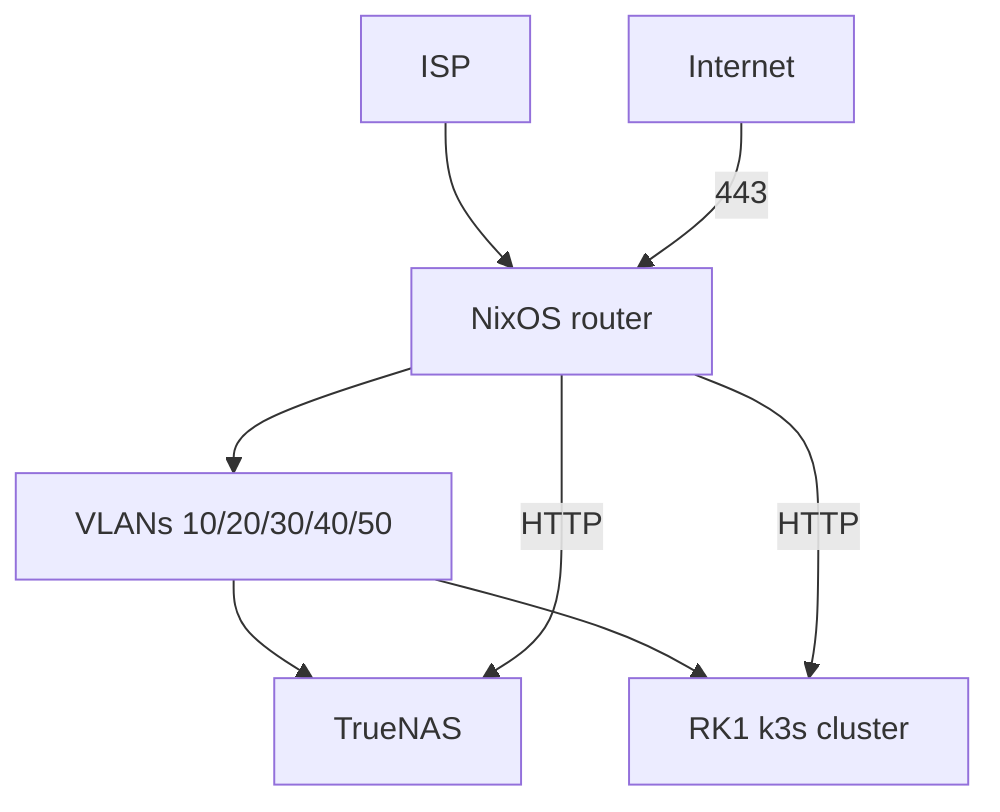

# Home network

Declarative homelab as it runs: NixOS router, VLAN segmentation, TrueNAS, k3s on Turing RK1, minimal public exposure.

The configs are the network. `router/`, `nodes/`, `switch/`, `services/`, `k8s/`, and `secrets/` are what is deployed. The docs in this directory describe that tree. When they disagree, the config wins; update the doc to match.

Open follow-ups are [todo.md](todo.md). Do not resume the old stage checklist. [implementation-stages.md](implementation-stages.md) only points at the living docs. NPU/GPU kernel work stays in [plans/rk1-bsp-fork.md](plans/rk1-bsp-fork.md) and is not on the todo.

## Documentation

| Doc | What it describes |
|-----|-------------------|
| [architecture.md](architecture.md) | Diagrams, traffic flows, service map |
| [decisions.md](decisions.md) | Choices in effect |
| [decision-briefs.md](decision-briefs.md) | Options and history (brief IDs are canonical) |
| [vlan-plan.md](vlan-plan.md) | VLANs, IPs, DHCP, DNS, IPv6 |
| [firewall-matrix.md](firewall-matrix.md) | nftables policy |
| [inventory.md](inventory.md) | Devices, ports, reservations |
| [todo.md](todo.md) | Open follow-ups on the live hosts |
| [implementation-stages.md](implementation-stages.md) | Retired rollout; not a backlog |
| [runbooks/](runbooks/) | Procedures for the live hosts |
| [reference/](reference/) | Alternatives not chosen |
| [plans/rk1-bsp-fork.md](plans/rk1-bsp-fork.md) | Deferred NPU/GPU kernel work |

Changing a host means editing the module or manifest that already implements it, then the doc that describes it. A new choice goes in [decisions.md](decisions.md). A finished follow-up is deleted from [todo.md](todo.md).

## Principles

- Self-hosted first — no Cloudflare, Tailscale SaaS, or tunnel vendors unless unavoidable.
- Router is the policy point **and** always-on edge (Caddy, Unbound, UniFi, Headscale); config lives in Git.
- VPN-first admin (WireGuard + Headscale); publish `img.zdk.no`, `ha.zdk.no`, and `code.zdk.no` on WAN. Apex `zdk.no` is not a homelab site. `*.lab.zdk.no` stays internal.
- `*.lab.zdk.no` is internal-only. Authelia on lab UIs except `auth` / `code.lab` / `headscale.lab` / `ha.lab` / `immich.lab` / `jellyfin.lab` / `truenas.lab` / `unifi.lab`. `jellyfin.lab` is household (guest + TV), not WAN.

## Decisions (summary)

Full table: **[decisions.md](decisions.md)**.

| Layer | Choice |
|-------|--------|
| Router | NixOS on Dell OptiPlex 9020 MT + i350-T2 (acquired); UniFi OS Server (functional) |
| Switch / WiFi | CRS310 + 2× USW Flex Mini + U7 Lite + PoE injector (all acquired); UPS deferred — [todo.md](todo.md) |
| Edge | Caddy on janus; HA, Immich, Authelia, Forgejo, Jellyfin as TrueNAS Apps |
| K8s | 4× RK1, NixOS, k3s, Flux, Traefik, Capacitor |
| Monitoring | kube-prometheus-stack + presence + unpoller + CRS310 SNMP + Blocky; Alertmanager |
| Public | `img.zdk.no` (Immich), `ha.zdk.no` (HA), `code.zdk.no` (Forgejo) — no Authelia |

## Architecture overview



Detail: [architecture.md](architecture.md).

## Network summary

| VLAN | Name | Subnet |
|------|------|--------|
| 10 | mgmt | `10.10.10.0/24` |
| 20 | trusted | `10.10.20.0/24` |
| 30 | servers | `10.10.30.0/24` |
| 40 | iot | `10.10.40.0/24` |
| 50 | guest | `10.10.50.0/24` |

IPs, DHCP, DNS, mDNS: [vlan-plan.md](vlan-plan.md). Firewall: [firewall-matrix.md](firewall-matrix.md).

## Service map

| Where | Services |
|-------|----------|
| **Router** (janus) | nftables, dnsmasq, Unbound, Caddy, WireGuard, Headscale, DNSUpdater, UniFi OS Server, node_exporter, presence, unpoller, snmp-exporter |
| **TrueNAS** `10.10.30.20` | HA, Immich, Authelia, Forgejo, Jellyfin (Apps); Blocky, Promtail |
| **k8s** | k3s, Traefik, Flux, Capacitor, kube-prometheus-stack |
| **Zpi** `10.10.30.15` | Audio casting to speakers |

Public services: [architecture.md § Public services](architecture.md#public-services).

## Public vs internal exposure

Full matrix: [decisions.md § Exposure matrix](decisions.md#exposure-matrix). Another public name follows brief 18 in [decision-briefs.md](decision-briefs.md) and a new row in that matrix before WAN cutover.

| Hostname | WAN | Authelia |
|----------|-----|----------|
| `code.zdk.no` | Yes | No |
| `img.zdk.no` | Yes | No |
| `ha.zdk.no` | Yes | No |
| `auth` / `code.lab` / `headscale.lab` / `jellyfin.lab` | Never | **No** |
| Other `*.lab.zdk.no` | **Never** | Yes |
| Future public apps | Per-app | Optional |

## Repo layout

Runbooks are in [runbooks/](runbooks/). k3s, Flux, Loki, Promtail, WAN Caddy, WireGuard, and Headscale are live. DNSUpdater is the [DNSUpdater](https://github.com/sknutsen/DNSUpdater) flake module on janus (Domeneshop `img`/`ha`/`code`/`vpn`; sops token/secret; Loki).

```
net/
├── flake.nix                    # NixOS configs (optiplex / janus)
├── docs/                        # this directory (incl. runbooks/)
├── router/                      # janus NixOS modules
├── nodes/                       # RK1 NixOS flake (k3s on; sops token)
├── switch/                      # CRS310
├── services/                    # truenas, caddy, authelia, dns, promtail, HA/Immich/Forgejo/Jellyfin READMEs
├── k8s/clusters/homelab/        # Flux infra
├── secrets/                     # .sops.yaml + encrypted router.yaml
└── scripts/                     # validate.sh, generate-viewer.py
```

## Reference material

| Topic | Chosen | Doc |
|-------|--------|-----|
| Auth | Authelia | [reference/auth-authelia-vs-authentik.md](reference/auth-authelia-vs-authentik.md) |
| Secrets | sops-nix | [reference/secrets-sops-vs-agenix.md](reference/secrets-sops-vs-agenix.md) |
| GitOps | Flux + Capacitor | [reference/gitops-flux-vs-argocd.md](reference/gitops-flux-vs-argocd.md) |
| Router OS | NixOS | [reference/router-os-alternatives.md](reference/router-os-alternatives.md) |
| RK1 escape | NixOS | [reference/escape-hatches-ubuntu-talos.md](reference/escape-hatches-ubuntu-talos.md) |
| CGNAT | Not active | [reference/cgnat-options.md](reference/cgnat-options.md) |
| Hardware | Core acquired; UPS deferred | [reference/hardware-bom-norway.md](reference/hardware-bom-norway.md) |

## Browser viewer

Markdown in this directory is the source of truth for the docs. Build a standalone HTML page (no HTTP server):

```bash
python3 scripts/generate-viewer.py --open
```

That writes `docs/generated/index.html` and opens it. Re-run after editing markdown.
