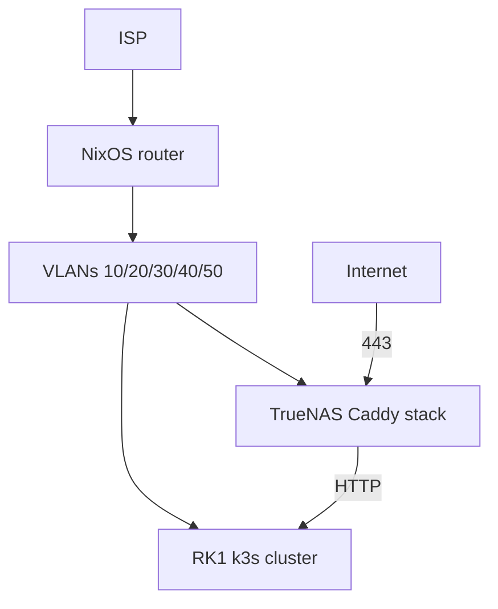

# Home network plan

Declarative homelab: NixOS router, VLAN segmentation, TrueNAS edge, k3s on Turing RK1, minimal public exposure.

## Documentation map

| Doc | Purpose |
|-----|---------|
| [decisions.md](decisions.md) | **Canonical decision log** |
| [vlan-plan.md](vlan-plan.md) | VLANs, IPs, DHCP, DNS, IPv6 |
| [firewall-matrix.md](firewall-matrix.md) | nftables policy |
| [inventory.md](inventory.md) | Devices, ports, reservations |
| [architecture.md](architecture.md) | Diagrams, traffic flows, service map |
| [implementation-stages.md](implementation-stages.md) | Stage 0–8 checklists |
| [decision-briefs.md](decision-briefs.md) | Open items — options, pros/cons, recommendations |
| [reference/](reference/) | Alternatives not chosen |
| [plans/rk1-bsp-fork.md](plans/rk1-bsp-fork.md) | Deferred NPU/GPU kernel work |

## Principles

- Self-hosted first — no Cloudflare, Tailscale SaaS, or tunnel vendors unless unavoidable.
- Router is the policy enforcement point; config lives in Git (NixOS flakes, Flux, Compose, SOPS).
- VPN-first admin (WireGuard + Headscale); publish `zdk.no` and `code.zdk.no` only in Stage 7.
- `*.lab.zdk.no` is internal-only — split-horizon DNS, Authelia, never WAN-reachable.

## Decisions (summary)

Full table: **[decisions.md](decisions.md)**.

| Layer | Choice |
|-------|--------|
| Router | NixOS on Dell OptiPlex 9020 MT + i350-T2 (acquired); UniFi OS Server |
| Switch / WiFi | CRS310 + U7 Lite + PoE injector (all acquired); UPS deferred |
| Edge | Caddy + Authelia + HA + Forgejo on TrueNAS Docker |
| K8s | 4× RK1, NixOS, k3s, Flux, Traefik, Capacitor |
| Monitoring | kube-prometheus-stack in k8s (incl. Loki) |
| Public | `zdk.no` (k8s), `code.zdk.no` (Forgejo) — no Authelia on current public apps |

## Architecture overview



Detail: [architecture.md](architecture.md).

## Network summary

| VLAN | Name | Subnet |
|------|------|--------|
| 10 | mgmt | `10.10.10.0/24` |
| 20 | trusted | `10.10.20.0/24` |
| 30 | servers | `10.10.30.0/24` |
| 40 | iot | `10.10.40.0/24` |
| 50 | guest | `10.10.50.0/24` |

IPs, DHCP, DNS, mDNS: [vlan-plan.md](vlan-plan.md). Firewall: [firewall-matrix.md](firewall-matrix.md).

## Service map

| Where | Services |
|-------|----------|
| **Router** | nftables, dnsmasq, Unbound, WireGuard, DNSUpdater, node_exporter |
| **Router** (OptiPlex) | nftables, dnsmasq, Unbound, WireGuard, DNSUpdater, **UniFi OS Server** |
| **TrueNAS** `10.10.30.20` | Caddy, Home Assistant, Forgejo, Authelia, Blocky, Promtail |
| **k8s** | k3s, Traefik, Flux, Capacitor, kube-prometheus-stack, Zdk (when ready) |
| **Zpi** `10.10.30.15` | Audio casting to speakers |

Public services: [architecture.md § Public services](architecture.md#public-services).

## Public vs internal exposure

| Hostname | WAN | Authelia |
|----------|-----|----------|
| `zdk.no` | Stage 7 | No |
| `code.zdk.no` | Stage 7 | No |
| `*.lab.zdk.no` | **Never** | Yes |
| Future public apps | Per-app | Optional |

## Implementation

Stages 0–8 with checklists: **[implementation-stages.md](implementation-stages.md)**.

- **Stage 5:** Internal HA, Forgejo (LAN SSH), Authelia, Blocky, k8s stack — no WAN.
- **Stage 7:** Enable WAN for `code.zdk.no` and/or `zdk.no` when ready.

## Open decisions

Items to resolve during implementation. Resolved choices are noted inline.
Full options and recommendations: **[decision-briefs.md](decision-briefs.md)**.

### Network and ISP

| # | Topic | Status / options |
|---|-------|------------------|
| 1 | IPv6 prefix size | Document in [vlan-plan.md](vlan-plan.md) at Stage 2 |
| 2 | CGNAT | **Resolved:** Not active — dynamic public IPv4; port forwarding works |
| 2a | UniFi host | **Resolved:** UniFi OS Server on OptiPlex (Podman); UI `:11443`, inform `:8080`. Not on TrueNAS (port clash). NixOS: Podman + vendor installer (impure state) |
| 3 | VPN IPv6 routes | **Resolved:** VPN clients get v6 routes to lab subnets |
| 4 | Hairpin NAT | **Likely not needed** — split-horizon sends LAN clients to `10.10.30.20` directly. Enable only if internal clients resolve public IP |
| 5 | NPTv6 vs native v6 per VLAN | **Resolved:** Native /64 per VLAN from delegated prefix; WAN inbound v6 default deny; revisit NPTv6 only if ISP delegates `/60` or smaller |

### DNS and filtering

| # | Topic | Status / options |
|---|-------|------------------|
| 6 | Blocky host | **Recommended:** TrueNAS Docker at `10.10.30.21` (see vlan-plan). Alternative: k8s Deployment |
| 7 | IoT `*.lab.zdk.no` | **Resolved:** Deny by default; whitelist specific names if a device needs one |
| 8 | Guest DNS | **Resolved:** Public resolvers (1.1.1.1 / 9.9.9.9). Restricted DNS via Blocky possible later |
| 9 | Public `lab` DNS record | **Resolved:** Not needed — `lab.zdk.no` is internal split-horizon only |

### Services

| # | Topic | Status / options |
|---|-------|------------------|
| 10 | Authelia host | **Resolved:** TrueNAS Docker |
| 11 | TrueNAS container logs | **Resolved:** Promtail in compose → Loki in k8s. Alternatives: Vector agent, syslog to Loki gateway |
| 12 | Compose layout | **Resolved:** Single `services/truenas/docker-compose.yml` only |
| 13 | MetalLB pool | **Resolved:** `10.10.30.100–110` — no conflicts with current static IPs |
| 14 | k8s API VIP (`10.10.30.10`) | **Resolved:** API at `10.10.30.11:6443` directly; reserve `.10` for future kube-vip if second CP added |
| 15 | Longhorn | **Resolved:** Default StorageClass; replica count **3**; NVMe at `/var/lib/longhorn` on all four RK1s (256 GB+ each); off-cluster backup via Velero or TrueNAS ZFS snapshots |
| 16 | Control-plane taint | **Resolved:** Keep default CP taint on `nordri`; workloads schedule on `sudri`–`vestri` only |
| 17 | Zdk repo boundary | **Resolved:** Flux `GitRepository` + `Kustomization` → [Zdk](https://github.com/sknutsen/Zdk) repo; `net/` keeps `k8s/clusters/homelab/apps/zdk/ingress.yaml` + Flux CR; Zdk repo owns Deployment, Service, image CI, app secrets |

### Security

| # | Topic | Status / options |
|---|-------|------------------|
| 18 | CrowdSec | **Resolved:** Not in v1; nftables rate-limit on 443 at Stage 7; deploy CrowdSec only if Caddy access logs show sustained brute force |
| 19 | Headscale | **Resolved:** Deploy alongside WireGuard in Stage 6 |
| 20 | Nintendo local play | **Deferred** |

### TLS

| # | Topic | Status / options |
|---|-------|------------------|
| 21 | `*.lab.zdk.no` certs | **Resolved:** Caddy ACME via **split-horizon HTTP-01** (Unbound → `10.10.30.20`); DNS-01 via Domeneshop API as fallback only; no public DNS for `lab` names |
| 22 | step-ca | **Resolved:** Not in v1; Caddy ACME covers edge TLS |
| 23 | Caddy → Traefik mTLS | **Non-goal for v1** |

### K8s platform

| # | Topic | Status / options |
|---|-------|------------------|
| 24 | RK1 OS | **Resolved:** NixOS (GiyoMoon mainline). Escape hatches are reference only |
| 25 | BSP / NPU fork | Deferred — [plans/rk1-bsp-fork.md](plans/rk1-bsp-fork.md) |

## Repo layout

```
net/
├── docs/
├── router/                      # NixOS flake (OptiPlex); UniFi OS Server via Podman (vendor)
├── nodes/                       # NixOS flake (RK1)
├── services/
│   ├── truenas/docker-compose.yml
│   ├── caddy/Caddyfile
│   ├── authelia/
│   ├── dns/
│   └── dnsupdater/
├── k8s/clusters/homelab/
├── secrets/
└── scripts/validate.sh
```

## Reference material

| Topic | Chosen | Doc |
|-------|--------|-----|
| Auth | Authelia | [reference/auth-authelia-vs-authentik.md](reference/auth-authelia-vs-authentik.md) |
| Secrets | sops-nix | [reference/secrets-sops-vs-agenix.md](reference/secrets-sops-vs-agenix.md) |
| GitOps | Flux + Capacitor | [reference/gitops-flux-vs-argocd.md](reference/gitops-flux-vs-argocd.md) |
| Router OS | NixOS | [reference/router-os-alternatives.md](reference/router-os-alternatives.md) |
| RK1 escape | NixOS | [reference/escape-hatches-ubuntu-talos.md](reference/escape-hatches-ubuntu-talos.md) |
| CGNAT | Not active | [reference/cgnat-options.md](reference/cgnat-options.md) |
| Hardware | Core acquired; UPS deferred | [reference/hardware-bom-norway.md](reference/hardware-bom-norway.md) |

## Browser viewer

Markdown in this directory is the source of truth. Build a standalone HTML page (no HTTP server):

```bash
python3 scripts/generate-viewer.py --open
```

That writes `docs/generated/index.html` and opens it. Re-run after editing markdown.
