# Home Network Architecture Plan

## Confirmed decisions

| Layer | Choice | Notes |
|-------|--------|-------|
| Router/firewall | **NixOS** on x86 (2+ NICs) | Flakes + `networking.firewall` + nftables; full declarative control |
| Router hardware | **Dell OptiPlex 9020 MT** (on hand) | Onboard **I217LM** = WAN; **Intel i350-T2** = LAN trunk to CRS310 (not router-on-a-stick) |
| VPN | **WireGuard** (+ optional self-hosted **Headscale** later) | High speed, simple, no vendor lock-in |
| Edge reverse proxy | **Caddy** — Docker on **TrueNAS SCALE** | VLAN 30; WAN 443/80; ACME; Authelia forward-auth; Caddyfile in `services/caddy/` |
| TrueNAS host | **VLAN 30** (servers) | Runs **Caddy**, **UniFi controller**, **Home Assistant** via Docker; static IP |
| K8s ingress | **Traefik** inside each cluster | Native Ingress/Gateway API; dynamic pod routing |
| Monitoring | **Prometheus + Grafana + Loki** | Metrics + dashboards + log aggregation (Promtail/Vector) |
| K8s GitOps | **Flux + Capacitor** (self-hosted) | In-cluster dashboard behind Caddy/Authelia; no local kubeconfig needed |
| Auth / SSO | **Authelia** | Caddy `forward_auth`; YAML in Git; Capacitor `trusted_proxy` |
| Secrets | **sops-nix + age** | Unified SOPS for NixOS router, Flux/K8s, and `secrets/` repo |
| WiFi AP | **Ubiquiti U6+** (1×) | **UniFi Network Application** — Docker on TrueNAS; SSID → VLAN mapping |
| Switch | **MikroTik CRS310-8G+2S+IN** | 8× 2.5G + 2× SFP+; SNMP; PoE injector for AP |
| K8s cluster | **1× homelab** — 4× RK1 (32 GB) on Turing Pi 2.5 | ARM64; expandable with x86 workers later |
| RK1 node OS | **NixOS + k3s** (dual profiles) | **Preferred:** GiyoMoon mainline + BSP fork for NPU/GPU. **Escape hatches:** Ubuntu 22.04 + k3s, Talos — documented, not removed |
| Public services | **`zdk.no`** + **`code.zdk.no`** | `zdk.no` → [Zdk](https://github.com/sknutsen/Zdk) on k8s; `code.zdk.no` → Forgejo on TrueNAS; VPN-first until Stage 7 |
| Forgejo Git (WAN) | **HTTPS only** | No WAN `:22` port-forward; SSH via WireGuard/trusted VLAN only |
| `zdk.no` app source | **[github.com/sknutsen/Zdk](https://github.com/sknutsen/Zdk)** | External repo (WIP); `net/` wires ingress only — no app scaffolding here |
| Vendor policy | **Self-hosted first** | No Cloudflare or SaaS dependencies unless unavoidable |
| WAN IPv4 | **Dynamic public IP** (not CGNAT) | DNSUpdater → Domeneshop; port forward 443 + WireGuard UDP |
| WAN IPv6 | **Prefix delegation** (enable) | Per-VLAN v6 subnets; inbound WAN v6 default deny |
| DDNS | **DNSUpdater** → **Domeneshop** | Dynamic `A`/`AAAA` for `@` (`zdk.no`), `code`, and `lab`; creds in sops-nix |
| Domain | **`zdk.no`** / **`code.zdk.no`** / **`lab.zdk.no`** | Public: apex + Forgejo; internal admin under `*.lab.zdk.no` |
| ISP modem | **Bridge mode** (confirmed) | OptiPlex is sole router; no double NAT |
| DHCP | **dnsmasq** (router) | IPv4 pools per VLAN; static reservations in NixOS |
| Home Assistant | **VLAN 30** — on **TrueNAS** | Same host as Caddy/UniFi (`10.10.30.20`); **servers → IoT** firewall |
| TrueNAS services | **Docker** on SCALE | **Caddy** + **UniFi** + **Home Assistant** + **Forgejo**; Compose in `services/truenas/` |
| Logging | **Loki** (+ Promtail or Vector) | Caddy, Traefik, nftables, system logs → Grafana |
| Location | **Norway** (~60 m² flat) | 1 AP sufficient; 8-port switch likely enough |

### Self-hosted principles

- **DNS:** Unbound/Blocky internally; public records via registrar API or self-hosted DNS — not Cloudflare.
- **Remote access:** WireGuard first; optional self-hosted Headscale for mesh — not Tailscale SaaS.
- **Ingress:** Caddy + Traefik on your hardware — not Cloudflare Tunnel or ngrok.
- **Auth:** [Authelia](https://www.authelia.com/) — forward-auth for Caddy and admin UIs
- **Secrets:** sops-nix + age — router, Flux, and services in one SOPS workflow
- **Monitoring/alerting:** Prometheus + Grafana + Alertmanager + **Loki** — not Datadog/New Relic.
- **CGNAT fallback order:** IPv6 public access → self-hosted DDNS + port forward → WireGuard-only (no public services) → last resort: self-hosted reverse tunnel (e.g. frp, rathole), never SaaS tunnel.

## Recommended direction (summary)

For your goals — **DIY router, IoT isolation, external services, high-speed VPN, maximum declarative config** — the locked-in stack is:

| Layer | Recommendation | Why |
|-------|----------------|-----|
| Router/firewall | **NixOS** on x86 (2+ NICs) | Best declarative story; rollbacks; you own the full stack |
| VPN | **WireGuard** (+ optional **Headscale**) | Fast, simple, modern crypto; native on NixOS |
| Edge proxy | **Caddy** — Docker on **TrueNAS** (VLAN 30) | Automatic HTTPS; Caddyfile in Git; Compose deploy to NAS |
| K8s routing | **Traefik** in-cluster | Service discovery, IngressRoute CRDs, middleware chains |
| K8s GitOps | **Flux + Capacitor** (self-hosted) | Git-native deploys; Capacitor on cluster behind Caddy/Authelia |
| Monitoring | **Prometheus + Grafana** | Industry-standard, exporters for router/NixOS/Caddy/K8s |
| Switch/AP | **Managed switch + separate APs** | VLANs only work end-to-end with managed gear |

**Default hardware assumption:** **Dell OptiPlex 9020 Mini Tower** (on hand) as NixOS router, MikroTik CRS310 switch, one Ubiquiti U6+ AP. For a ~60 m² flat, a single centrally placed AP is sufficient.

---

## Site profile (confirmed)

| Detail | Your situation | Plan impact |
|--------|----------------|-------------|
| Location | Norway | Buy from NO/EU retailers where possible; factor 25% MVA; import toll on US/AliExpress orders |
| Flat size | ~60 m² | One AP covers adequately; U6+ class is enough (U6-LR is overkill) |
| WAN IPv4 | Dynamic **public** IP (not CGNAT) | DNSUpdater → Domeneshop; port forward works |
| WAN IPv6 | Prefix delegation (to enable) | Assign per-VLAN v6; filter inbound on WAN |
| ISP modem | Bridge mode (confirmed) | No double NAT |
| Domain | `zdk.no` / `lab.zdk.no` | Homelab services under `*.lab.zdk.no` |
| TrueNAS | VLAN 30 — **Caddy + UniFi + HA** (Docker) | Static IP e.g. `10.10.30.20`; port-forward WAN → this host |
| AP count | 1× **Ubiquiti U6+** | UniFi controller Docker on TrueNAS |

---

## Device inventory

Mapped to VLANs for firewall rules, dnsmasq reservations, and switch/AP SSID assignment.

### Servers (VLAN 30)

| Name | Hardware | OS | Static IP | Connection |
|------|----------|-----|-----------|------------|
| **TrueNAS** | NAS | TrueNAS SCALE | **`10.10.30.20`** | Wired (port 4) — Caddy, UniFi, HA |
| **Turing Pi** | 4× RK1 | NixOS + k3s | `10.10.30.11–14` | Wired (port 3) |
| **Zpi** | Raspberry Pi 5 | Raspbian | `10.10.30.15` | Wired (port 5) |

**Turing Pi BMC:** separate Ethernet → **VLAN 10 (mgmt)** only.

### Trusted (VLAN 20) — SSID `Home`

| Name | Hardware | OS | Static IP | Connection |
|------|----------|-----|-----------|------------|
| **Pingu** | Desktop / gaming | NixOS | `10.10.20.10` | Wired (port 6, 2.5G) |
| **Socrates** | ThinkPad | NixOS | `10.10.20.11` | WiFi `Home` or docked |
| **Remorse** | MacBook Air | macOS | `10.10.20.12` | WiFi `Home` |
| **Peon** | Work laptop | Windows | `10.10.20.13` | WiFi `Home` |
| **Pixel 7** | Phone | Android | `10.10.20.14` | WiFi `Home` — **confirmed trusted** |

### IoT (VLAN 40) — SSID `IoT` + wired hubs

Only devices that need **direct IP reachability** (HA, casting) get static reservations. Bulbs, sensors, and other hub-managed gear **do not need IPs**.

| Name | Hardware | Static IP | Connection | HA / notes |
|------|----------|-----------|------------|------------|
| **Samsung TV** | Smart TV (Tizen) | `10.10.40.10` | WiFi `IoT` | HA; casting target |
| **Rusken** | Roborock vacuum | `10.10.40.11` | WiFi `IoT` | HA |
| **Phillips Hue hub** | Hue Bridge | `10.10.40.12` | **Wired** (port 7) | HA → hub only; bulbs via Zigbee |
| **IKEA Trådfri** | Dirigera/Gateway | `10.10.40.13` | **Wired** (port 8) | HA → hub only; bulbs via Zigbee/Thread |
| **Nintendo Switch** | Console | `10.10.40.14` | WiFi `IoT` | Online gaming; local LAN play optional |
| **Samsung Odyssey** | Smart Monitor | `10.10.40.15` | WiFi `IoT` | HA / SmartThings; casting target |
| **Chromecast** | Google Chromecast | `10.10.40.16` | WiFi `IoT` (HDMI to TV) | Casting from trusted; HA optional |

**Hub-managed (no IP):** Hue bulbs, Trådfri lights, other Zigbee/Thread accessories — controlled through hubs only.

### VLAN assignment rationale

| Zone | Devices | Policy |
|------|---------|--------|
| **30 servers** | TrueNAS, Turing Pi, Zpi | Trusted + VPN access; **HA → IoT** outbound |
| **20 trusted** | Pingu, Socrates, Remorse, Peon, Pixel 7 | User devices; reach servers + internet |
| **40 iot** | TV, Odyssey, Chromecast, Rusken, hubs, Switch | Internet + HA; hubs proxy bulb access |

**Peon:** Trusted for now — isolate later if work policy requires.

**Zpi:** Servers VLAN — move to trusted if it becomes a daily driver.

**Nintendo Switch on IoT:** Keeps console off your LAN; enable **trusted → Switch IP** only if local multiplayer with Pingu is needed.

**Pixel 7:** **Confirmed trusted** — same access as laptops.

**IoT without IPs:** Smart bulbs, sensors, and similar devices join via Hue/Trådfri/Zigbee — no dnsmasq entry; firewall only cares about hub and named IoT hosts above.

### Home Assistant (TrueNAS) → IoT

All integrations use **servers → IoT ALLOW** from `10.10.30.20` to hub/device IPs. Configure static IPs in HA where possible:

| Integration | Target IP |
|-------------|-----------|
| Samsung TV | `10.10.40.10` |
| Roborock (Rusken) | `10.10.40.11` |
| Philips Hue hub | `10.10.40.12` |
| IKEA Trådfri hub | `10.10.40.13` |
| Samsung Odyssey (Smart Monitor) | `10.10.40.15` |
| Chromecast | `10.10.40.16` |

**Hue + Trådfri hubs:** **Confirmed wired** — CRS310 ports 7 and 8 (access VLAN 40).

### Special connectivity notes

**Casting (trusted → IoT):** Phones/laptops cast to **Samsung TV**, **Odyssey Smart Monitor**, or **Chromecast**. If discovery fails after segmentation, allow **trusted → specific IPs** only:

| Target | IP | Ports (typical) |
|--------|-----|-----------------|
| Samsung TV | `10.10.40.10` | UDP 1900, TCP 8008–8009 |
| Chromecast | `10.10.40.16` | UDP 5353, TCP 8008–8009, dynamic high ports |
| Odyssey Smart Monitor | `10.10.40.15` | Same as TV/cast targets per Samsung app |

Do not open trusted → entire `10.10.40.0/24`.

**Roborock:** Often uses cloud + local API; may need outbound HTTPS; block inbound from WAN only.

**Nintendo Switch:** Nintendo online works from IoT; for **local wireless play** with Pingu, add trusted ↔ Switch on Nintendo ports or temporarily same VLAN.

**NixOS workstations (Pingu, Socrates):** WireGuard for remote access; optional future NixOS deploy target.

### dnsmasq static reservations

| Hostname | IP | VLAN |
|----------|-----|------|
| `truenas.lab.zdk.no` | `10.10.30.20` | 30 |
| `rk1-1` … `rk1-4` | `10.10.30.11–14` | 30 |
| `zpi.lab.zdk.no` | `10.10.30.15` | 30 |
| `pingu.lab.zdk.no` | `10.10.20.10` | 20 |
| `socrates.lab.zdk.no` | `10.10.20.11` | 20 |
| `remorse.lab.zdk.no` | `10.10.20.12` | 20 |
| `peon.lab.zdk.no` | `10.10.20.13` | 20 |
| `pixel7.lab.zdk.no` | `10.10.20.14` | 20 |
| `samsung-tv.iot.lab.zdk.no` | `10.10.40.10` | 40 |
| `rusken.iot.lab.zdk.no` | `10.10.40.11` | 40 |
| `hue.iot.lab.zdk.no` | `10.10.40.12` | 40 |
| `tradfri.iot.lab.zdk.no` | `10.10.40.13` | 40 |
| `switch.iot.lab.zdk.no` | `10.10.40.14` | 40 |
| `odyssey.iot.lab.zdk.no` | `10.10.40.15` | 40 |
| `chromecast.iot.lab.zdk.no` | `10.10.40.16` | 40 |

MAC addresses: fill at deploy in router flake. **No reservations** for individual bulbs or hub-child devices.

### CRS310 port plan

| Port | Mode | VLAN | Device |
|------|------|------|--------|
| 1 | trunk | all | OptiPlex i350 (router) |
| 2 | trunk | all | Ubiquiti U6+ (AP) |
| 3 | access | 30 | Turing Pi 2.5 uplink |
| 4 | access | 30 | TrueNAS |
| 5 | access | 30 | Zpi (Raspberry Pi 5) |
| 6 | access | 20 | Pingu (desktop) |
| 7 | access | 40 | Phillips Hue hub (wired) |
| 8 | access | 40 | IKEA Trådfri hub (wired) |

**WiFi SSIDs:** `Home` → VLAN 20 (laptops, Pixel 7, Peon); `IoT` → VLAN 40 (TV, Odyssey, Chromecast, Rusken, Switch).

---

## Operational decisions (expanded)

Locked-in choices from site setup plus detailed considerations for components still being designed.

### Router cabling: dedicated WAN + trunk (not router-on-a-stick)

**Router-on-a-stick** means the router has **one physical NIC** connected to the switch. That single cable carries:

- Untagged WAN traffic (modem VLAN or native WAN), and
- Tagged VLAN trunks for all internal networks (10, 20, 30, 40, 50)

The router distinguishes WAN vs LAN using **802.1Q VLAN subinterfaces** on the one port. It works fine with a managed switch like the CRS310, but WAN and all LAN VLANs share one link (and one point of failure).

**Your layout (confirmed):**

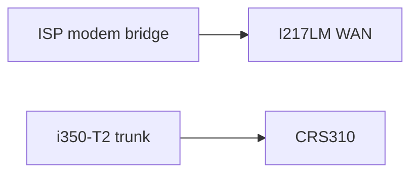

| Port | Role |
|------|------|
| Onboard **I217LM** | WAN only — modem/ONT in bridge mode |
| **i350-T2** port 1 | 802.1Q trunk → CRS310 (all VLANs) |
| **i350-T2** port 2 | Spare (spare switch uplink, diagnostics, or future DMZ) |

Cleaner separation, easier troubleshooting, and WAN issues do not affect the trunk port.

### DHCP on router (confirmed: dnsmasq)

**Locked:** **dnsmasq** on the OptiPlex for IPv4 DHCP on VLANs 10, 20, 30, 40, 50. Kea is not planned unless requirements change.

| | **dnsmasq** (chosen) | Kea (not used) |
|---|------------------------|----------------|
| Complexity | Low — one config block per VLAN | Higher — JSON config, separate DHCPv4/v6 |
| NixOS support | Mature `services.dnsmasq` | `services.kea` available |
| Fit for homelab | **Confirmed** | Only if DHCPv6 becomes complex |

**Configuration:**

- Static reservations: see **Device inventory → dnsmasq static reservations** (servers, trusted, IoT).
- **DHCP options:** push internal DNS (Unbound on router `10.10.x.1`) and domain `lab.zdk.no`.
- **IoT/guest:** shorter lease times (e.g. 1 h); trusted/servers use 24 h.

**Example pools:**

| VLAN | Subnet | DHCP range (example) |
|------|--------|----------------------|
| 10 mgmt | `10.10.10.0/24` | `.100–.200` |
| 20 trusted | `10.10.20.0/24` | `.100–.250` |
| 30 servers | `10.10.30.0/24` | `.20–.50` (most servers static) |
| 40 iot | `10.10.40.0/24` | `.100–.250` |
| 50 guest | `10.10.50.0/24` | `.100–.250` |

Revisit **Kea** only if you need advanced DHCPv6 management beyond NixOS RA + static v6.

### Home Assistant on VLAN 30 with IoT access

**Yes — this is possible and recommended.** Home Assistant (HA) stays on **VLAN 30 (servers)** alongside NAS, Caddy, and cluster nodes. IoT devices remain on **VLAN 40**. HA **initiates** connections to IoT devices (outbound from servers → IoT); IoT does not need broad access to your LAN.

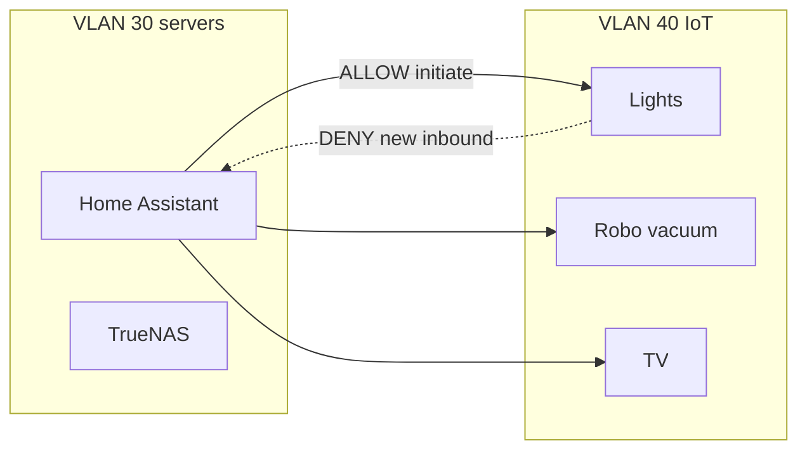

**Firewall rules (add to matrix):**

| Rule | Action |
|------|--------|
| **IoT → any RFC1918** | DENY (unchanged — IoT cannot reach trusted/servers/mgmt) |
| **Servers (TrueNAS `10.10.30.20`) → IoT** | **ALLOW** tcp/udp — Home Assistant controls devices |
| **IoT → HA** | DENY **new** connections; ALLOW `ct state established,related` only (return traffic for sessions HA opened) |
| **Trusted → HA** | ALLOW `8123/tcp` (web UI) from VLAN 20 + VPN |
| **IoT → HA** | DENY (devices don't need the HA UI) |

**Home Assistant** on TrueNAS at **`10.10.30.20:8123`** (same IP as Caddy/UniFi).

**Discovery caveats (mDNS/Bonjour):**

Many IoT integrations use IP or cloud APIs and work without cross-VLAN mDNS. Local discovery (Hue, ESPHome mDNS, some Shelly) may need extra help:

| Approach | When to use |
|----------|-------------|
| **Static IPs / hostnames** in HA | **Preferred** — configure `configuration.yaml` or UI with `10.10.40.x` addresses |
| **Unicast DNS** | Register critical IoT devices in Unbound (e.g. `bulb-kitchen.iot.lab.zdk.no`) |
| **mDNS reflector** (Avahi on router) | Only if many devices need broadcast discovery — scope **servers ↔ IoT only**, never to guest/trusted |
| **Home Assistant multicast** | Some setups use `homeassistant.components.dhcp` + known subnets; document IoT subnet in HA |

**Do not** move HA to IoT VLAN just for discovery — that puts your automation hub in the untrusted zone.

**Optional:** Run HA on **TrueNAS** (VM or app) on VLAN 30 — same firewall rules apply by IP.

### DNS filtering

Split into **resolution** (who answers DNS queries) and **filtering** (what gets blocked).

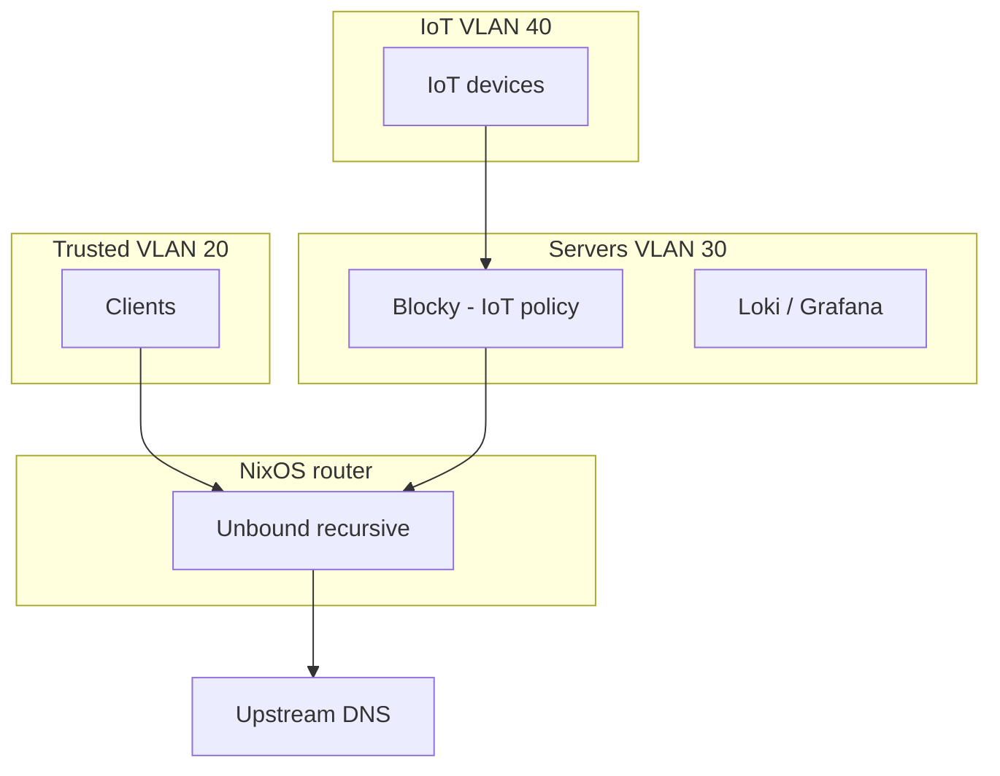

| Component | Role | VLAN |
|-----------|------|------|
| **Unbound** (router) | Recursive resolver, split-horizon, local `lab.zdk.no` records | All VLANs — direct for trusted/servers; upstream for Blocky |
| **Blocky** (servers) | Blocklists, query logging, restrictive policy | **IoT only** — firewall redirects IoT DNS to Blocky |
| **Guest** | No internal name resolution | Force public DNS (1.1.1.1 / 9.9.9.9) or allow through Blocky with strict policy |

**Why not AdGuard Home?** Heavier, web UI-centric; Blocky is config-file/Git-friendly and fits your declarative model.

**IoT isolation details:**

- Firewall: IoT DNS **only** to Blocky IP on VLAN 30 (block direct 53/853 to internet except through policy).
- Blocky upstream → Unbound on router (so local `*.lab.zdk.no` still resolves if you allow it — or **deny** internal zones for IoT via Blocky).
- **Split-horizon:** Unbound view so IoT cannot resolve `*.lab.zdk.no` internal records (returns NXDOMAIN or filtered).
- Export Blocky query metrics to Prometheus; alert on anomalies (optional Loki for query logs).

**Public DNS (Domeneshop):**

| Record | Type | Purpose |
|--------|------|---------|
| `@` (`zdk.no`) | `A` / `AAAA` | Apex → dynamic public IP |
| `code` | `A` / `AAAA` (or `CNAME` → `zdk.no`) | Forgejo (`code.zdk.no`) |
| `lab` | `A` / `AAAA` | Homelab entry (`*.lab.zdk.no` services via split-horizon) |

- **DDNS:** DNSUpdater updates `@`, `code`, and `lab` records (and `AAAA` when v6 is stable) — multiple timer units or a wrapper script, one `.env` per record via sops-nix.
- Internal-only vhosts (`grafana.lab.zdk.no`, `capacitor.lab.zdk.no`, etc.) use split-horizon — not public WAN hostnames unless explicitly opened later.

**Split-horizon (Unbound on router):**

- `zdk.no` → `10.10.30.20` (Caddy — consistent LAN/VPN/WAN entry point)
- `code.zdk.no` → `10.10.30.20`
- `*.lab.zdk.no` → internal IPs (existing pattern)
- VPN clients use internal view

### Caddy host (confirmed: TrueNAS Docker)

**Locked:** Caddy runs as **Docker on TrueNAS SCALE**, VLAN 30 — same host as Home Assistant and UniFi controller.

| Detail | Choice |
|--------|--------|
| **Host** | TrueNAS SCALE, static IP **`10.10.30.20`** |
| **Deploy** | Docker Compose from `services/caddy/docker-compose.yml` (or TrueNAS Apps) |
| **Config** | `services/caddy/Caddyfile` in Git; mount into container |
| **ACME storage** | Dataset mount e.g. `tank/services/caddy/data` — snapshot with NAS backups |
| **Logs** | Docker logging → Promtail → Loki |

**Ports on TrueNAS (same IP):**

| Service | Ports |
|---------|-------|
| **Caddy** | 443/tcp, 80/tcp (WAN port-forward targets these) |
| **UniFi** | 8443/tcp, 8080/tcp, 3478/udp, 10001/udp |
| **Home Assistant** | 8123/tcp |
| **Forgejo** | 3000/tcp (internal Docker network; Caddy reverse-proxies) |

**Router firewall:** WAN `443`/`80` → `10.10.30.20` only; **WAN `22` — deny** (no Forgejo SSH exposure); Caddy → Traefik MetalLB (`10.10.30.100`); deny WAN → Traefik direct. Forgejo SSH (if enabled in container): trusted VLAN 20 + WireGuard → TrueNAS only.

### Public services (confirmed)

Two hostnames are internet-reachable via Caddy. Homelab admin UIs (`*.lab.zdk.no`) remain **VPN/trusted-VLAN only**.

**`zdk.no` — Zdk web app (k8s)**

| Detail | Choice |
|--------|--------|
| **Application source** | [github.com/sknutsen/Zdk](https://github.com/sknutsen/Zdk) — developed in that repo, not in `net/` |
| **Status** | **Work in progress** — `net/` documents routing/GitOps wiring only; no framework/stack decisions, Dockerfile, or app scaffolding here |
| **Hosting (when ready)** | Homelab k8s via **Flux**; Traefik `IngressRoute` with `Host(\`zdk.no\`)` |
| **Edge** | Caddy `reverse_proxy` → Traefik MetalLB `10.10.30.100` on HTTP |
| **Auth** | None (public app); **no Authelia** `forward_auth` |
| **TLS** | Terminate at Caddy (public ACME); Traefik serves HTTP internally |
| **Deployment boundary** | Container image, build pipeline, and Deployment spec live in **Zdk**; `net/` adds ingress/Caddy integration when deployable |

**`code.zdk.no` — Forgejo (TrueNAS Docker)**

| Detail | Choice |
|--------|--------|
| **Image** | `codeberg.org/forgejo/forgejo` |
| **Deploy** | Docker Compose in `services/truenas/docker-compose.yml` |
| **Persistence** | `tank/services/forgejo/data` + `tank/services/forgejo/config` |
| **Env** | `FORGEJO__server__ROOT_URL=https://code.zdk.no`, `FORGEJO__server__SSH_DOMAIN=code.zdk.no` |
| **Auth** | Forgejo-native; **no Authelia** in front |
| **Git (WAN)** | **HTTPS only** (`git clone https://code.zdk.no/...`); **WAN SSH disabled** — optional SSH via WireGuard/trusted VLAN |

**Caddyfile** (`services/caddy/Caddyfile`):

```caddyfile
zdk.no {
    reverse_proxy 10.10.30.100:80
    encode gzip
}

code.zdk.no {
    reverse_proxy forgejo:3000
    encode gzip
}
```

**k8s ingress stub** (`k8s/clusters/homelab/apps/zdk/`): `IngressRoute` for `Host(\`zdk.no\`)` — Service reference added when Zdk repo ships a Deployment. Flux `GitRepository` may point at `sknutsen/Zdk` when manifests exist there.

Internal-only vhosts (`*.lab.zdk.no`) keep existing Authelia `forward_auth` blocks — unchanged.

**Upstream:** HTTP to Traefik MetalLB; Authelia `forward_auth` for admin UIs.

**Not used:** RK1 LXC, Caddy on router, Caddy in K8s hostNetwork.

**Upgrade note:** Schedule TrueNAS updates off-peak; Caddy/UniFi/HA restart together — acceptable for homelab.

### UniFi controller (confirmed: TrueNAS Docker)

**Locked:** **UniFi Network Application** runs as **Docker on TrueNAS SCALE** — same host as Caddy and Home Assistant (`10.10.30.20`).

| Detail | Choice |
|--------|--------|
| **Image** | `linuxserver/unifi-network-application` or `jacobsjo/unifi-docker` |
| **Deploy** | Docker Compose alongside Caddy in `services/unifi/` or single `services/truenas/docker-compose.yml` |
| **Persistence** | Dataset bind mount e.g. `tank/services/unifi/data` — included in NAS snapshots |
| **Access** | Trusted VLAN + VPN only; **never** on WAN |

**Firewall:** AP → `10.10.30.20` (UniFi ports); trusted → `:8443`; block IoT/guest → controller.

**SSIDs → VLANs:** guest → 50, trusted → 20, IoT → 40.

**Alternatives not used:** K8s Helm, Cloud Key, separate VM — documented for reference only.

### Internal TLS

Three TLS layers in your architecture:

| Layer | Traffic | Approach |
|-------|---------|----------|
| **Public (WAN)** | Internet → Caddy | **ACME** (Let's Encrypt) for `zdk.no`, `code.zdk.no`, and `*.lab.zdk.no` |
| **Internal (LAN/VPN)** | Browser → Caddy/Grafana/etc. | ACME **internal** or **step-ca**-issued certs |
| **East-west (VLAN 30)** | Caddy → Traefik | **HTTP** initially (trusted L2); optional **mTLS** later |

**Recommended phased approach:**

1. **Now:** Public ACME on Caddy; internal admin UIs accessed via **VPN or trusted VLAN** with Caddy ACME certs (same hostnames, split-horizon DNS points to internal IP).
2. **Optional step-ca:** Deploy on VLAN 30 when you want short-lived internal certs for devices, mTLS Caddy→Traefik, or cert-based auth. Integrates with sops-nix for CA keys.
3. **Do not** use self-signed certs scattered per service — centralize through Caddy or step-ca.

**Split-horizon DNS example:**

- `zdk.no` / `code.zdk.no` → `10.10.30.20` internally (Unbound → Caddy)
- `grafana.lab.zdk.no` → `10.10.30.x` internally (Unbound)
- Same names → public IP externally (Domeneshop) when Stage 7 enables WAN access
- VPN clients use internal view

### IPv6 prefix delegation

Norwegian fibre (Telenor, Altibox, etc.) typically delegates a **/56** or **/48** via DHCPv6-PD. With bridge mode confirmed, the **OptiPlex** requests the prefix — not the modem.

**NixOS (sketch):**

```nix
# router WAN — enable PD
networking.interfaces.wan.ipv6 = {
  enable = true;
  acceptRA = true;
  dhcpv6.clientConfig = {
    dhcpv6.name-servers = [ ];
  };
};
networking.interfaces.wan.ipv6pd = {
  enable = true;
  interface = "lan";  # or per-VLAN interfaces
  prefixLength = 64;  # per downstream network
};
```

**Per-VLAN v6 (example from /56):**

| VLAN | IPv6 subnet (example) |
|------|------------------------|
| 20 trusted | `2a0x:yyyy:20::/64` |
| 30 servers | `2a0x:yyyy:30::/64` |
| 40 iot | `2a0x:yyyy:40::/64` |
| 50 guest | `2a0x:yyyy:50::/64` |

**Security (critical):**

- **WAN inbound v6: default deny** — same posture as IPv4; no open ports except what you explicitly forward.
- **IoT/guest v6:** Internet egress allowed; **no** access to RFC1918 **or** ULA/internal v6 of other VLANs.
- **NPTv6 or separate subnets:** Consider NPTv6 if you want v6 egress without exposing internal topology.

**DNS:**

- DNSUpdater: add **`AAAA`** records for `@`, `code`, and `lab` when v6 is stable (Domeneshop API).
- **Stage 7:** IPv6 public access may reduce reliance on port forwarding for some services.

**WireGuard:** Can tunnel IPv6; decide if VPN clients get v6 routes to lab subnets.

**Stage 2 task:** Confirm delegated prefix size from ISP logs; document in `docs/vlan-plan.md`.

### Remaining open decisions

None for public services — list is confirmed. Zdk application implementation continues in [github.com/sknutsen/Zdk](https://github.com/sknutsen/Zdk).

---

## Target architecture

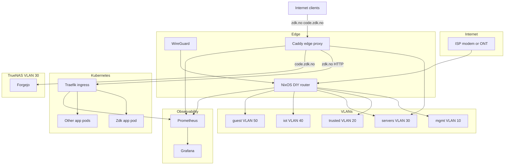

**Principle:** The router is the **policy enforcement point**. Everything else (DNS, proxy, monitoring) runs on hosts in defined VLANs, configured from Git.

---

## Router OS: NixOS (confirmed)

NixOS is the right fit for a declarative DIY router. Key implementation notes:

- **Config:** Nix flake with `hosts/router/configuration.nix` — interfaces, VLANs, DHCP (**dnsmasq**), nftables firewall, WireGuard, Unbound forwarder.
- **Updates:** `nixos-rebuild switch --flake .#router` on a schedule; test in VM first via `nixos-rebuild build-vm`.
- **WiFi:** Use external APs on trunk ports; do not run WiFi on the router itself.
- **Rollback:** `nixos-rebuild --rollback` if a change breaks connectivity; keep serial console access.
- **Monitoring:** Export node_exporter on router; scrape from Prometheus in VLAN 30.

### Other OS options (not chosen, for reference)

- **OPNsense/pfSense:** Strong firewall UI; less declarative than NixOS.
- **OpenWrt:** Better for embedded/low-power; not ideal as a homelab core router.
- **Headscale (self-hosted):** Optional overlay control plane — not a router OS, but useful later for mesh without SaaS Tailscale.

---

## VLAN design

Use **one subnet per security zone**, consistent IDs everywhere (switch, AP, router).

| VLAN ID | Name | Subnet (example) | Members | Policy |
|---------|------|------------------|---------|--------|
| 10 | mgmt | `10.10.10.0/24` | Switch/AP management, iDRAC/IPMI if isolated | Admin devices only; no internet unless required for updates |
| 20 | trusted | `10.10.20.0/24` | Laptops, desktops, phones you control | Full LAN access per policy; can reach servers |
| 30 | servers | `10.10.30.0/24` | Homelab, **TrueNAS**, **Home Assistant**, Caddy, UniFi, RK1 cluster | Inbound from trusted + VPN; **HA → IoT** outbound allowed |
| 40 | iot | `10.10.40.0/24` | TV, Rusken, Hue, Trådfri, Switch, smart peripherals | Internet + HA from servers; no LAN initiate |
| 50 | guest | `10.10.50.0/24` | Visitors | Internet only; client isolation on WiFi |
| 99 | wan-bridge | — | Optional; only if needed for modem bridge quirks | — |

### Firewall rules (intent, router-enforced)

1. **IoT → any RFC1918:** DENY (prevents lateral movement to laptops/servers).
2. **Servers (Home Assistant) → IoT:** **ALLOW** tcp/udp — HA controls devices on VLAN 40.
3. **IoT → servers:** DENY new; ALLOW `established,related` (return traffic for HA sessions only).
4. **IoT → internet:** ALLOW with DNS via Blocky; log anomalies.
5. **Guest → RFC1918:** DENY.
6. **Trusted → servers:** ALLOW (incl. HA `:8123`, admin UIs).
7. **Trusted → IoT (optional):** ALLOW to **cast targets only** — TV `.10`, Odyssey `.15`, Chromecast `.16` (not whole IoT subnet).
8. **Servers → internet:** ALLOW.
9. **VPN → trusted + servers + mgmt:** ALLOW.
10. **Internet → LAN:** DENY by default; only **443/tcp** (+ **80** ACME) to TrueNAS `10.10.30.20`.

### WiFi mapping

- SSID `Home` → VLAN 20 (WPA3 where supported).
- SSID `IoT` → VLAN 40 (many IoT devices need 2.4 GHz only).
- SSID `Guest` → VLAN 50 (AP client isolation ON).
- Wired trusted machines → switch ports **untagged VLAN 20** (or trunk if multi-VLAN host).

### Inter-VLAN routing

Keep routing **only on the router** (router-on-a-stick or router with multiple NICs). Disable inter-VLAN routing on the switch except L2 forwarding. Use **private DNS views** so IoT cannot resolve internal hostnames (split-horizon DNS).

---

## External access model

**Default posture: VPN-first, publish minimum.**

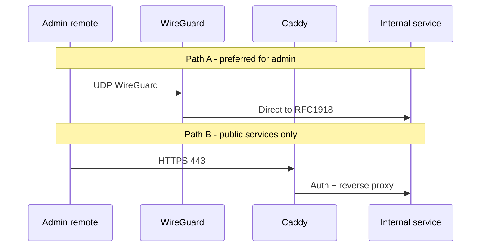

### What to expose publicly

- **Reverse proxy (Caddy)** on servers VLAN with public DNS `A`/`AAAA` records.
- **WireGuard** UDP port (high random port, e.g. `51820`) — optionally **not** advertised; use dynamic DNS if no static IP.
- **Do not** port-forward SSH, NAS UI, or random app ports.

### Reverse proxy: two-tier model (Caddy edge + Traefik in K8s)

**Short answer:** Use **Caddy at the edge** and **Traefik inside Kubernetes**. They solve different problems; using both is not redundant if TLS terminates once at the edge.

| Concern | Caddy (edge) | Traefik (in-cluster) |
|---------|--------------|----------------------|
| WAN ingress, single 443 entry | Excellent | Possible but awkward outside K8s |
| ACME / public TLS | Excellent (built-in) | Good (cert-manager or Traefik ACME) |
| Static VMs, NAS, non-K8s apps | Excellent (Caddyfile) | Requires static Service endpoints |
| Dynamic pod lifecycle | Manual upstream updates | Excellent (watches K8s API) |
| Ingress / Gateway API CRDs | No native K8s integration | Excellent (IngressRoute, Gateway API) |
| Declarative Git config | Caddyfile in repo | Helm values + IngressRoute YAML via Flux |
| Middleware (auth, rate limit) | Caddy + Authelia forward-auth | Traefik middleware CRDs |

**Why not Caddy-only for K8s?** Caddy has a [Kubernetes ingress controller](https://github.com/caddyserver/ingress), but it is less mature than Traefik's ecosystem. Every pod scale-up/down requires ingress reconciliation; Traefik and ingress-nginx are the battle-tested choices for in-cluster routing. Caddy shines where config is stable and file-based.

**Why not Traefik-only everywhere?** Traefik works as an edge proxy, but Caddy's Caddyfile is simpler for a homelab edge that mixes K8s and non-K8s backends (Grafana, NAS, Authelia). Less YAML, automatic HTTPS, easier to reason about as a single WAN entry point.

#### Recommended traffic flow

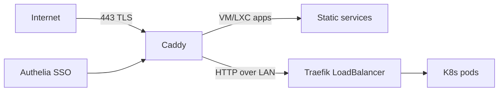

1. **Internet → Caddy (TrueNAS Docker, `10.10.30.20`):** Terminates public TLS; applies Authelia forward-auth for admin UIs.
2. **Caddy → non-K8s backends:** Direct reverse proxy (Grafana, Portainer on VM, etc.).
3. **Caddy → K8s backends:** Proxy to Traefik's internal LoadBalancer IP (MetalLB or kube-vip) on HTTP; Traefik handles per-service routing inside the cluster.
4. **Avoid double TLS:** Caddy terminates public certs; Traefik serves HTTP internally (or uses internal CA certs if you prefer end-to-end TLS within VLAN 30).

#### If you run multiple K8s clusters

- One Traefik (or Gateway API controller) per cluster.
- Caddy routes by hostname: `app1.example.com` → cluster A Traefik LB, `app2.example.com` → cluster B.
- Keep all cluster ingress on VLAN 30 (servers); firewall allows only Caddy → Traefik LB ports.

Run Caddy on **TrueNAS Docker** (VLAN 30), not on the NixOS router.

### Hardening external access (self-hosted, no vendor lock-in)

1. **Single entry:** Only 443 (and 80→redirect) to Caddy; WireGuard UDP separately.
2. **SSO / forward auth:** Self-hosted [Authelia](https://www.authelia.com/) in front of admin UIs.
3. **Per-app ACLs:** Caddy `forward_auth` to Authelia; Traefik middleware for in-cluster apps that bypass Caddy (none should — all public traffic goes through Caddy).
4. **TLS:** Public ACME certs on Caddy (Let's Encrypt); internal CA via [step-ca](https://smallstep.com/certificates/) for LAN and optional Caddy→Traefik mTLS.
5. **DNS:** Self-hosted authoritative or split-horizon via Unbound views; public `A`/`AAAA` only when needed. **DDNS:** [DNSUpdater](https://github.com/sknutsen/DNSUpdater) on a schedule — not a CDN/proxy vendor.
6. **Rate limiting:** Caddy `rate_limit` module + self-hosted [CrowdSec](https://www.crowdsec.net/) bouncer.
7. **No CDN/proxy vendors:** Avoid Cloudflare and similar unless CGNAT makes all else impossible (see below).
8. **Admin UIs internal-only:** Capacitor, Grafana admin, UniFi controller — reachable from trusted VLAN or VPN only; never on public WAN.
9. **No management on WAN:** Switch/AP admin only from mgmt VLAN or VPN.
10. **Updates:** Automated `nixos-rebuild` on router; watch flake inputs; alert via Prometheus on failed deploys.
11. **Logging:** Self-hosted Loki + Promtail (or Vector) for Caddy/Traefik/firewall logs; Grafana alerting on WAN deny spikes.

---

## VPN: high speed, secure, simple

**Primary: WireGuard**

- Kernel implementation on NixOS/Linux = excellent throughput on x86.
- One `/32` per client in `10.10.255.0/24` (VPN overlay); peers get routes to `10.10.0.0/16` (or selective routes).
- Store keys in Git **encrypted** (age/sops) or generate per-device outside Git.
- Mobile + laptop configs via QR (wg-easy is optional UI; not required).

**Optional additions**

- **Headscale** if you want mesh/exit nodes across sites without opening multiple ports.
- **Do not** use OpenVPN for new deployments unless a device requires it.
- **IPsec (StrongSwan)** only for legacy client compatibility.

**Performance tips**

- Intel NIC with hardware checksum offload enabled.
- MTU 1420 on WireGuard tunnel if PPPoE upstream.
- Keep crypto default (ChaCha20); no need to tune unless benchmarking.

---

## Monitoring: Prometheus + Grafana (confirmed)

Self-hosted observability stack in VLAN 30 (can run on K8s or a dedicated VM).

### Components

| Component | Role | Deploy target |
|-----------|------|---------------|
| **Prometheus** | Metrics collection + alerting rules | VM or K8s (Helm: kube-prometheus-stack) |
| **Grafana** | Dashboards + alert routing | Same host/cluster as Prometheus |
| **Alertmanager** | Alert dedup, routing to notifications | Bundled with kube-prometheus-stack |
| **node_exporter** | Host metrics (router, VMs, NAS) | NixOS router + each Linux host |
| **snmp_exporter** | Switch/AP metrics (if SNMP supported) | Prometheus scrape target |
| **blackbox_exporter** | HTTP/TCP/ICMP probes (WAN, Caddy, apps) | Prometheus scrape target |
| **Loki + Promtail** | Log aggregation (optional but recommended) | VLAN 30; scrape Caddy, Traefik, nftables logs |

### Key dashboards and alerts

- **Network:** WAN up/down (ICMP to ISP gateway), interface throughput per VLAN, firewall deny rate from WAN.
- **Router:** NixOS node_exporter — CPU, memory, conntrack usage, WireGuard peer handshake age.
- **Ingress:** Caddy and Traefik request rate, 4xx/5xx ratio, ACME cert expiry (blackbox or native metrics).
- **K8s:** kube-prometheus-stack defaults — node health, pod restarts, PVC usage.
- **Alerts:** WAN down, cert expiring <14 days, conntrack >80%, IoT DNS query anomalies (if Blocky exports metrics).

### Declarative config

- Prometheus rules and scrape configs in `services/prometheus/` (or Helm values in Git).
- Grafana dashboards as code (Jsonnet or Grafana provisioning files).
- Deploy via NixOS module, Docker Compose, or Flux/Helm — pick one per host and stay consistent.

---

## Declarative repo layout

This repository is the **network source of truth**:

```
net/
├── README.md
├── docs/
│   ├── plan.md                  # this file
│   ├── vlan-plan.md
│   ├── firewall-matrix.md
│   └── runbooks/
├── router/                      # NixOS flake (x86_64 — OptiPlex)
│   ├── flake.nix
│   ├── hosts/router/
│   │   └── configuration.nix    # interfaces, VLANs, dhcp, firewall, wg, node_exporter
│   └── modules/
├── nodes/                       # NixOS flake (aarch64 — RK1 cluster)
│   ├── flake.nix                # dual kernel profiles: mainline | bsp
│   ├── flake.lock               # pin nixpkgs, giyoMoon, bsp fork separately
│   ├── profiles/
│   │   ├── mainline.nix         # imports GiyoMoon module (default k8s bring-up)
│   │   └── bsp.nix              # imports local BSP fork module (NPU/GPU path)
│   ├── bsp/                     # Armbian/vendor BSP fork (see setup plan below)
│   │   ├── flake.nix
│   │   ├── pkgs/
│   │   │   ├── kernel/          # Joshua-Riek/linux-rockchip packaged as Nix derivation
│   │   │   ├── firmware/        # Mali G610, RKNPU blobs
│   │   │   └── uboot/           # optional; may reuse GiyoMoon U-Boot output
│   │   └── modules/
│   │       └── boards/
│   │           └── turing-rk1.nix
│   ├── modules/
│   │   ├── k3s.nix              # services.k3s server/agent (shared across profiles)
│   │   ├── longhorn.nix         # NVMe mount for /var/lib/longhorn
│   │   └── labels.nix           # homelab/kernel-profile, kubernetes.io/arch
│   └── hosts/
│       ├── rk1-1.nix            # control plane
│       └── rk1-{2,3,4}.nix      # workers
├── services/
│   ├── truenas/                 # Docker Compose for TrueNAS (Caddy + UniFi + HA + Forgejo)
│   │   └── docker-compose.yml
│   ├── caddy/
│   │   └── Caddyfile            # edge proxy: zdk.no, code.zdk.no, Authelia, K8s upstreams
│   ├── forgejo/                 # Forgejo env reference + volume paths
│   │   └── README.md
│   ├── unifi/                   # UniFi env/volumes reference (or merged in truenas/)
│   ├── traefik/                 # Helm values or IngressRoute manifests per cluster
│   ├── prometheus/
│   │   ├── prometheus.yml
│   │   ├── rules/
│   │   └── grafana/dashboards/
│   ├── dns/                     # unbound/blocky config
│   ├── dnsupdater/              # sknutsen/DNSUpdater (submodule or copy)
│   └── authelia/
├── k8s/                         # Flux bootstrap + HelmReleases per cluster
│   └── clusters/
│       └── homelab/
│           ├── flux-system/
│           ├── infrastructure/  # Traefik, kube-prometheus-stack
│           └── apps/
│               └── zdk/         # zdk.no ingress only (no app code — source: github.com/sknutsen/Zdk)
│                   ├── ingressroute.yaml
│                   └── kustomization.yaml
├── tools/
│   └── capacitor/               # self-hosted Capacitor Helm/manifest + config
├── secrets/                     # sops/age encrypted (DNSUpdater .env, WireGuard, etc.)
├── ansible/                     # optional: switch/AP if supported
└── scripts/
    └── validate.sh              # caddy fmt, nix flake check, promtool check
```

**Tooling**

- **NixOS:** `nix flake check`, `nixos-rebuild switch --flake .#router`
- **Secrets:** [sops-nix](https://github.com/Mic92/sops-nix) + age (confirmed)
- **Auth:** Authelia in `services/authelia/` (confirmed)
- **DNS/DHCP:** **dnsmasq** on router; Blocky on servers VLAN for IoT filtering
- **Switch/AP:** Export configs where possible; document manual steps in `docs/` until Ansible modules exist

---

## Additional considerations (often overlooked)

| Topic | Recommendation |
|-------|----------------|
| **IPv6** | Enable on WAN; filter inbound default deny; per-VLAN v6 subnets or NPTv6; test IoT v6 leakage |
| **DNS** | Internal resolver + filtering; IoT uses restricted policy; DNS-over-HTTPS blocking on router if paranoid |
| **NTP** | Internal NTP or router broadcast; IoT phoning home for time is fine but consistent TZ helps logs |
| **Multicast/mDNS** | IoT and Chromecast often need mDNS reflector **within** IoT VLAN only (Avahi/broadcast relay); never reflect across to trusted |
| **UPnP/NAT-PMP** | **Disable** on router; breaks some games but saves IoT from opening ports |
| **Backup** | Router config in Git; switch/AP export monthly; test restore |
| **Power** | UPS on router + switch; clean shutdown scripts |
| **Monitoring** | **Prometheus + Grafana** (confirmed); Loki for logs; Alertmanager for notifications |
| **Certificate recovery** | Document ACME account key backup; Caddy storage backup |
| **Physical security** | Router in locked rack/closet; mgmt VLAN prevents tampering from guest/IoT |
| **ISP modem** | Bridge mode to your router; avoid double NAT |
| **Proprietary IoT cloud** | VLAN isolation limits blast radius; expect outbound-only traffic; log DNS queries |
| **Hairpin NAT** | Enable NAT loopback if you test public URLs from inside LAN |
| **Emergency access** | Serial console or one out-of-band mgmt port on router |
| **Compliance noise** | Guest + IoT privacy; minimal logging of guest traffic |

---

## Implementation stages

Stages marked **(parallel)** can run concurrently with others in the same row.

### Stage 0 — Design and inventory (parallel with Stage 1)

- [x] Document devices — see **Device inventory** (servers, trusted, IoT, peripherals).
- [ ] Document ISP IPv6 prefix size; confirm CGNAT status at install time.
- [ ] Finalize VLAN table, IP plan, and firewall matrix in `docs/` (copy from plan).
- [ ] Inventory NICs, switch, AP capabilities (802.1Q, SSID VLAN).
- [ ] List K8s clusters and edge vs in-cluster services (Turing Pi = homelab cluster).

### Stage 1 — Hardware and physical (parallel with Stage 0)

- [ ] Verify **OptiPlex 9020 MT**: onboard I217LM → WAN; **Intel i350-T2** port 1 → CRS310 trunk.
- [ ] Cable: modem (bridge) → router WAN (I217LM); i350 trunk → CRS310; AP on switch trunk port.
- [ ] Label ports and assign switch port VLANs on paper.

### Stage 2 — Core router (depends: Stage 1 WAN link)

- [ ] Install NixOS from flake; set WAN DHCP/PPPoE.
- [ ] Configure VLAN interfaces on router; enable DHCP per VLAN.
- [ ] Default deny firewall; allow established; basic LAN → WAN NAT.
- [ ] Enable node_exporter for Prometheus scraping.
- [ ] Verify each VLAN gets correct subnet and internet (temporary permissive rules).

### Stage 3 — Switch and WiFi VLANs (parallel: Stage 2 once router VLANs exist)

- [ ] Configure switch: trunk to router, access ports per VLAN.
- [ ] AP: SSID → VLAN mapping; guest isolation; disable legacy insecure modes where possible.
- [ ] Test wired + wireless client lands in correct subnet.

### Stage 4 — Segmentation hardening (depends: Stage 3)

- [ ] Apply full firewall matrix (IoT/guest isolation).
- [ ] Deploy internal DNS (Unbound/Blocky); IoT restrictive policy.
- [ ] mDNS/Bonjour scoped to IoT only if needed.
- [ ] Validate: IoT cannot ping trusted; **HA on VLAN 30 can reach IoT devices**; IoT cannot initiate to HA UI.

### Stage 5 — Internal services (parallel: Stage 4 DNS; needs servers VLAN)

- [ ] Stand up homelab hosts in VLAN 30 (TrueNAS static `10.10.30.20`).
- [ ] Deploy **Caddy + UniFi** Docker on TrueNAS from `services/truenas/docker-compose.yml`.
- [ ] Deploy Prometheus + Grafana + **Loki** (+ Promtail/Vector, Alertmanager).
- [ ] Internal TLS via step-ca; Caddy internal certs for LAN-only services.
- [ ] Backups and centralized logging.
- [ ] If using K8s: bootstrap Flux; deploy Traefik + kube-prometheus-stack via HelmRelease.
- [ ] Deploy self-hosted Capacitor in-cluster; expose via Caddy + Authelia (VPN or trusted VLAN only).

### Stage 6 — VPN (depends: Stage 4; parallel with Stage 5)

- [ ] WireGuard on router; sops-managed keys.
- [ ] Client configs for laptop/phone; test full-tunnel vs split-tunnel routes.
- [ ] Confirm VPN → servers/mgmt works; VPN cannot bypass Authelia for public apps unless intended.

### Stage 7 — External access (public services)

VPN-first during Stages 0–6. Caddy vhosts can be prepared; Forgejo can run internally; **Zdk WAN exposure waits until [github.com/sknutsen/Zdk](https://github.com/sknutsen/Zdk) is deployable**.

**Forgejo (`code.zdk.no`) — can enable independently:**

- [ ] Domeneshop: `A`/`AAAA` for `code` (and `lab` if needed); low TTL
- [ ] DNSUpdater timers for `@`, `code`, and `lab` public records
- [ ] **TrueNAS:** Deploy Forgejo container; backup dataset `tank/services/forgejo`
- [ ] Caddyfile: `code.zdk.no` → Forgejo; ACME succeeds
- [ ] Forgejo: disable open registration; set admin account; confirm **no WAN :22** port-forward
- [ ] Document git workflow: public `git clone https://...`; optional SSH via WireGuard only
- [ ] External validation: `curl -I https://code.zdk.no`

**`zdk.no` — enable when Zdk ships a container/deploy spec:**

- [ ] Domeneshop: `A`/`AAAA` for `@`; DNSUpdater for apex
- [ ] Flux: deploy Zdk from its repo (image/build defined there — not in `net/`)
- [ ] Traefik `IngressRoute` for `Host(zdk.no)`; Caddy vhost active
- [ ] Split-horizon Unbound record for apex
- [ ] External validation: `curl -I https://zdk.no`

**Always:**

- [ ] WireGuard admin access for internal services
- [ ] Caddy + Authelia running for `*.lab.zdk.no` (trusted VLAN / VPN)
- [ ] Confirm `*.lab.zdk.no` admin UIs still require VPN/Authelia (not accidentally public)
- [ ] SSL Labs or external validation scan when WAN is enabled

**Dependency:** `zdk.no` requires k8s bootstrap (Flux, MetalLB, Traefik) **and** a deployable artifact from the Zdk repo.

### Stage 8 — Operationalize (depends: all above)

- [ ] `validate.sh` in CI (flake check, caddy fmt).
- [ ] Runbooks: restore router, rotate WG keys, ACME failure.
- [ ] Final security pass: disable unused services, review logs, UPS test.

### Ongoing — Repo scaffolding (parallel from day 0)

- [ ] Scaffold `router/` NixOS flake, `services/`, `secrets/` layout.

---

## Parallel workstreams

| Stream | Stages | Notes |
|--------|--------|-------|
| **A — Physical** | 0, 1 | Inventory + cabling |
| **B — Router core** | 2 | Blocks full VLAN testing |
| **C — L2 wireless** | 3 | Parallel once router trunks |
| **D — Policy** | 4 | IoT isolation validation |
| **E — Homelab** | 5 | Servers, DNS, monitoring |
| **F — Remote access** | 6, 7 | VPN then public services |
| **G — GitOps** | 0→8 | Repo scaffolding in parallel from day 0 |

**Maximum parallelism after Stage 2:** Streams C, E, and F (WireGuard) can proceed in parallel; Stage 7 needs Caddy from E.

---

## Suggested first commits

1. `docs/vlan-plan.md` + `docs/firewall-matrix.md`
2. `router/` NixOS flake skeleton with VLAN + firewall modules
3. `services/truenas/docker-compose.yml` — Caddy + UniFi + Forgejo Docker; `services/caddy/Caddyfile` with `zdk.no` + `code.zdk.no`
4. `k8s/clusters/homelab/` Flux bootstrap + infrastructure HelmReleases (incl. Capacitor)
5. `services/prometheus/` scrape config + starter alert rules
6. `secrets/.sops.yaml` + age key setup (documented, not committed)
7. Document Capacitor install in `docs/runbooks/capacitor.md`

---

---

## Auth: Authelia (confirmed)

Authentik comparison below is **reference only** (not chosen).

## Auth: Authelia vs Authentik (reference)

Both are self-hosted and work with Caddy. They solve different problems.

### At a glance

| Aspect | Authelia | Authentik |
|--------|----------|-----------|
| **Role** | Forward-auth gateway + light OIDC | Full identity provider (IdP) |
| **Primary use** | Login wall in front of reverse proxy | Central SSO/OIDC/SAML/LDAP for apps |
| **Caddy integration** | Native `forward_auth` — designed for this | Proxy provider (ForwardAuth) or OIDC per app |
| **Config style** | YAML in Git | Web UI (+ export); less Git-native |
| **RAM** | ~50–100 MB | ~500 MB–2 GB (PostgreSQL + Redis + workers) |
| **Dependencies** | Optional Redis; SQLite/PostgreSQL for storage | PostgreSQL + Redis required |
| **Protocols** | Forward auth, OIDC (limited IdP), LDAP client | OIDC, OAuth2, SAML, LDAP server, SCIM, RADIUS |
| **MFA** | TOTP, WebAuthn, Duo | TOTP, WebAuthn, Duo, SMS |
| **User management** | YAML-defined users/groups | Admin UI, self-service portal, enrollment flows |
| **Multi-user / teams** | Basic | Strong — built for orgs |
| **Capacitor fit** | `AUTH=trusted_proxy` + Authelia headers — well documented | Same pattern possible; more setup |

### When Authelia fits better (recommended for your stack)

- **Caddy forward-auth** is your primary pattern (Capacitor, Grafana, admin UIs).
- You want **config-as-code** — `configuration.yml` committed to `services/authelia/`.
- **Solo or few users** — no need for user self-service portal.
- **Minimal resources** on VLAN 30 homelab.
- You do not need **SAML** or Authentik-as-LDAP-server.
- Matches NixOS/Flux declarative philosophy.

### When Authentik fits better

- You need a **full IdP** — apps use native OIDC/SAML (not just forward-auth).
- **Multiple users** with self-service password reset, enrollment, group management.
- You want **LDAP outbound** (other services authenticate against your IdP).
- **Visual flow builder** for login/MFA policies per application.
- You are fine with **4+ containers**, PostgreSQL backups, and UI-first config.
- Planning to grow into a small-team environment.

**Confirmed: Authelia** — Caddy `forward_auth` for Capacitor, Grafana, and admin UIs; config in `services/authelia/`.

Authentik remains an option if you later need SAML, LDAP-as-IdP, or multi-user self-service.

### Repo layout

```
services/authelia/
├── configuration.yml
├── users_database.yml      # or LDAP backend later
└── docker-compose.nix      # or NixOS module / K8s deployment
```

---

## Secrets: sops-nix (confirmed)

agenix comparison below is **reference only** (not chosen).

## Secrets: sops-nix vs agenix (reference)

Both encrypt secrets in Git for NixOS. Your repo also has **Flux (SOPS-native)** and non-NixOS services (Caddy), which affects the choice.

### At a glance

| Aspect | agenix | sops-nix |
|--------|--------|----------|
| **Encryption** | age (via SSH host keys or age keys) | Mozilla SOPS (age, PGP, optional KMS) |
| **File model** | One secret = one `.age` file | Multiple secrets per YAML/JSON/ENV file |
| **NixOS integration** | `age.secrets` in `configuration.nix` | `sops.secrets` in `configuration.nix` |
| **Config** | `secrets.nix` (pure Nix) | `.sops.yaml` + encrypted files |
| **Decrypt at** | Boot via activation script → `/run/agenix` | Boot → `/run/secrets` |
| **Flux/K8s** | Separate SOPS setup needed | **Same SOPS files** as Flux — unified |
| **Non-NixOS services** | Manual `age -d` or copy decrypted | `sops` CLI decrypt for Caddy, scripts |
| **Learning curve** | Lower — "one file, one secret" | Higher — SOPS rules, file formats |
| **Many related secrets** | Many small files | One `secrets.yaml` with keys |
| **Per-host access** | `secrets.nix` defines recipients per secret | `.sops.yaml` creation rules per path |
| **Yubikey** | age-plugin-yubikey | age-plugin-yubikey, GPG |

### When agenix fits better

- Secrets are **only on the NixOS router** (WireGuard keys, DDNS API creds, Unbound keys).
- You want the **simplest NixOS-native** workflow — `agenix -e secret.age`.
- Few standalone secrets (<10); one file per secret is fine.
- You are happy running **separate SOPS** for Flux/K8s secrets (two systems).

### When sops-nix fits better (recommended for your stack)

- **Unified secrets** across NixOS router, Flux HelmRelease secrets, and `services/` configs.
- Flux already uses **SOPS + age** — same `.sops.yaml` and keys for router and cluster.
- WireGuard keys, Authelia secrets, and K8s credentials in one `secrets.yaml` (different keys per env).
- **Non-NixOS Caddy host** can decrypt with `sops -d` in deploy scripts if needed.
- Scales when secret count grows (mail, DB, API tokens bundled per service).

### Hybrid (possible but not ideal)

| Layer | Tool |
|-------|------|
| NixOS router | agenix |
| Flux / K8s | SOPS |

Works, but you maintain two encryption workflows and two key-management stories. Only worth it if router secrets stay completely isolated.

**Confirmed: sops-nix + age** — one secrets system for NixOS router, Flux/K8s, and `secrets/` in this repo.

agenix remains an option for router-only simplicity; not chosen to keep Flux and router on the same SOPS workflow.

### Repo layout (sops-nix)

```
secrets/
├── .sops.yaml              # creation rules; which age keys per path
├── router.yaml             # WireGuard, DDNS API creds, node_exporter TLS
├── cluster.yaml            # Flux/K8s secrets (or per-cluster files)
└── README.md               # key generation, rotation runbook
```

Router references via `sops-nix`:

```nix
sops.secrets.wg-private-key = { sopsFile = ../../secrets/router.yaml; key = "wg_private_key"; };
```

---

## Open decisions

None for public services. Zdk application code and container build remain in [github.com/sknutsen/Zdk](https://github.com/sknutsen/Zdk) until ready for Stage 7.

---

## DDNS: DNSUpdater (confirmed)

[sknutsen/DNSUpdater](https://github.com/sknutsen/DNSUpdater) — Python tool that updates a DNS record when your public IP changes. Supports **Domeneshop**, Cloudflare, and Linode (relevant for Norway: Domeneshop is common).

### How DNSUpdater works

| Mode | Command | Behaviour |
|------|---------|-----------|
| **One-shot** | `python3 main.py -m 0` | Run update once; exit |
| **Service** | `python3 main.py -m 1` | Built-in scheduler — runs at **:00 every hour** |

Configuration via `.env` (not committed — generated from sops-nix secrets on the router).

**Supported providers (`.env`):**

| Provider | Key variables |
|----------|---------------|
| **domeneshop** | `PROVIDER=domeneshop`, `TOKEN`, `SECRET`, `DOMAIN_NAME` + `RECORD_NAME` (or `DOMAIN_ID` + `RECORD_ID`) |
| cloudflare | `AUTH_MODE`, `AUTH_EMAIL`, `AUTH_KEY`, `ZONE_ID`, `RECORD_NAME`, `RECORD_TYPE` |
| linode | `DOMAIN_ID`, `RECORD_ID`, `TOKEN` |

### Recommended deployment on NixOS router

Prefer **systemd timer + one-shot mode** over the built-in `schedule` loop — keeps process management idiomatic on NixOS and lets you set your own interval.

| Aspect | Choice |
|--------|--------|
| **Where** | NixOS router (reads WAN/public IP directly) |
| **Schedule** | `systemd.timer` every 10–15 min → `main.py -m 0` |
| **Secrets** | `.env` rendered from sops-nix at deploy time → `/run/secrets/dnsupdater.env` |
| **Dependencies** | `python3`, `python-dotenv`, `domeneshop` pip package (or vendor in repo) |

### Repo layout

```
services/dnsupdater/           # vendored or submodule: sknutsen/DNSUpdater
├── main.py
├── dns_updater/
├── requirements.txt
└── .env.example               # template only — real .env from sops

router/modules/dnsupdater.nix  # systemd service + timer, env file from sops
```

### NixOS integration (sketch)

```nix
# secrets/router.yaml (sops): dnsupdater_token, dnsupdater_secret, domain_name, record_name

systemd.services.dnsupdater = {
  description = "DNSUpdater one-shot";
  serviceConfig = {
    Type = "oneshot";
    WorkingDirectory = "/etc/dnsupdater";
    ExecStart = "${pkgs.python3}/bin/python3 main.py -m 0";
    EnvironmentFile = config.sops.secrets.dnsupdater-env.path;
  };
};

systemd.timers.dnsupdater = {
  wantedBy = [ "timers.target" ];
  timerConfig = { OnBootSec = "2min"; OnUnitActiveSec = "10min"; };
};
```

Alternatively: run DNSUpdater in **Docker** on a VLAN 30 host (repo includes `docker-compose.yml`) — heavier; router-native is simpler.

### Domeneshop setup (confirmed)

1. Create API token + secret at [domeneshop.no](https://www.domeneshop.no) → API settings.
2. Set `PROVIDER=domeneshop`, `DOMAIN_NAME`, `RECORD_NAME`, `TOKEN`, `SECRET` in secrets.
3. Ensure the `A` record exists (or let Domeneshop API create on first update if using their dyndns endpoint — DNSUpdater uses the REST API for record update by ID/name).
4. Set low TTL on the public `A` record (300–600 s).

### Hardening

- `.env` / API credentials **only** in sops-nix — never in Git plaintext.
- Log timer runs via journald; alert if DNSUpdater fails repeatedly (Prometheus journal exporter or script exit-code monitoring).
- Optional: `blackbox_exporter` HTTP probe on public hostname to verify DNS propagation.

### WAN access section note

DNSUpdater replaces a hand-written script and ddclient. Run before enabling public Caddy vhosts for `zdk.no` and `code.zdk.no`.

---

## K8s cluster: Turing Pi 2.5 + 4× RK1 (confirmed)

One homelab cluster on **4× Turing RK1** modules in a **Turing Pi 2.5** board. All cluster traffic on **VLAN 30 (servers)**.

### Hardware specs (RK1)

| Spec | Detail |
|------|--------|
| SoC | Rockchip RK3588 — 4× A76 + 4× A55 (ARM64) |
| RAM | **32 GB** LPDDR4x per module (confirmed) |
| Default storage | 32 GB eMMC (too small for K8s long-term) |
| Network | 1× GbE per node (via Turing Pi switch) |
| Management | Turing Pi BMC — flash OS, power control |

### RK1 physical setup

1. **Install 4 RK1 modules** in Turing Pi 2.5 slots; ensure heatsinks/thermal pads seated.
2. **Add NVMe per node** (strongly recommended) — 256 GB+ NVMe on each RK1; boot order is NVMe > eMMC. eMMC-only works for testing but fills fast with container images and Longhorn.
3. **Power** — use the official Turing Pi PSU; connect board to UPS with router/switch.
4. **Uplink** — Turing Pi GbE port → managed switch **access port on VLAN 30** (servers).
5. **BMC** — connect BMC Ethernet to **VLAN 10 (mgmt)** or trusted VLAN only; never expose BMC to WAN or IoT.

### Node layout (4 nodes)

| Node | Slot | Role | RAM |
|------|------|------|-----|
| rk1-1 | 1 | **control plane** | 32 GB |
| rk1-2 | 2 | worker | 32 GB |
| rk1-3 | 3 | worker | 32 GB |
| rk1-4 | 4 | worker | 32 GB |

**Control plane:** 1 node (homelab-acceptable). With 32 GB on rk1-1, you can optionally remove the control-plane taint and schedule workloads there too — useful before x86 nodes are added.

**Capacity:** ~28–30 GB schedulable per node after system/kube reserved. Total cluster ~112 GB — comfortable for Prometheus, Traefik, Flux, Capacitor, and many apps without tight memory pressure.

### IP plan (example, VLAN 30)

| Host | IP | Notes |
|------|-----|-------|
| rk1-1 | `10.10.30.11` | control plane |
| rk1-2 | `10.10.30.12` | worker |
| rk1-3 | `10.10.30.13` | worker |
| rk1-4 | `10.10.30.14` | worker |
| **truenas** | `10.10.30.20` | Caddy, UniFi, Home Assistant |
| **zpi** | `10.10.30.15` | Raspberry Pi 5 |
| k8s API | `10.10.30.10` | optional VIP or use rk1-1 IP |
| MetalLB pool | `10.10.30.100–110` | Traefik LB, etc. |

**VLAN 20 (trusted):** Pingu `.10`, Socrates `.11`, Remorse `.12`, Peon `.13`, Pixel 7 `.14`

**VLAN 40 (iot):** TV `.10`, Rusken `.11`, Hue `.12`, Trådfri `.13`, Switch `.14`, Odyssey `.15`, Chromecast `.16` — bulbs/sensors: **no IP**

Configure static IPs via Netplan (Ubuntu), Talos machine config, or NixOS `networking.interfaces`. Register in internal DNS.

### OS choice: NixOS preferred; Ubuntu / Talos escape hatches

**Confirmed:** RK1 nodes target **NixOS + k3s** with dual kernel profiles (`mainline` / `bsp`). **Ubuntu 22.04 + k3s** and **Talos Linux** remain fully documented escape hatches — use them if NixOS bring-up blocks progress, without replanning the cluster layer.

| | **NixOS + k3s** (preferred) | **Ubuntu 22.04 + k3s** (escape hatch A) | **Talos Linux** (escape hatch B) |
|---|-------------------------------|-------------------------------------------|----------------------------------|
| Turing Pi docs | [GiyoMoon](https://github.com/GiyoMoon/nixos-turing-rk1) | [Official k3s guide](https://docs.turingpi.com/docs/turing-pi2-kubernetes-installation) | [Sidero RK1 guide](https://docs.siderolabs.com/talos/v1.8/platform-specific-installations/single-board-computers/turing_rk1) |
| Kubernetes | **k3s** via `services.k3s` | **k3s** (curl install) | **Standard K8s** (bundled) |
| RK1 boot chain | U-Boot on eMMC + NixOS on NVMe | Ubuntu image via BMC | Talos image + SPI U-Boot on eMMC |
| RK firmware/kernel | Nix-packaged (mainline or BSP) | Vendor Ubuntu-rockchip | Sidero `sbc-rockchip` overlay |
| Node management | `nixos-rebuild` / deploy-rs | SSH, apt, Netplan | `talosctl` only |
| Unified with NixOS router | **Strongest** | Partial | Partial |
| NVMe boot | U-Boot stub on eMMC → NVMe | Flash Ubuntu to NVMe via BMC | SPI overlay on eMMC; OS on NVMe |
| NPU/GPU | BSP profile fork | Vendor kernel (easiest) | Not available |
| x86 workers later | NixOS amd64 + k3s | Same k3s agent join | Talos amd64 nodes |
| When to use | **Default** | Boot blocked; fastest official path | Immutable nodes without Nix port |

#### NixOS on RK1 — is it possible?

**Yes**, including RK1-specific firmware and kernel pieces — but not as a turnkey `nixos-hardware` module yet. Community projects package the board-specific parts in Nix:

| Component | How it works in Nix |
|-----------|---------------------|
| **U-Boot** | Turing RK1 defconfig + Rockchip `BL31` / `ROCKCHIP_TPL` blobs from `rkbin`; see [GiyoMoon/nixos-turing-rk1](https://github.com/GiyoMoon/nixos-turing-rk1) `#uboot-turing-rk1` |
| **Device tree** | `rk3588-turing-rk1.dts` — from Armbian or upstream; set via `hardware.deviceTree` |
| **Kernel** | **Mainline** (GiyoMoon uses NixOS 25.11 stable kernel) **or** **Armbian/vendor BSP kernel** packaged as custom `boot.kernelPackages` (see [nixos-rk3588](https://github.com/gnull/nixos-rk3588) pattern) |
| **Firmware blobs** | Mali GPU firmware etc. — pull from Armbian/vendor into Nix store if needed |
| **NVMe boot** | U-Boot stays on eMMC (small image); full NixOS system on NVMe — same pattern as Talos NVMe boot |

**Proof it works in the wild:** [GiyoMoon/homenix](https://github.com/GiyoMoon/homenix) runs **NixOS + k3s + sops-nix + deploy-rs** on Turing RK1 nodes today.

**Dual-profile flake design** — GiyoMoon mainline as default/fallback; BSP fork prepared for NPU/GPU:

```nix
# nodes/flake.nix (conceptual)
{
  inputs = {
    nixpkgs.url = "github:NixOS/nixpkgs/nixos-25.11";
    # Mainline profile — community RK1 port; good for k8s-only bring-up
    turing-rk1-mainline = {
      url = "github:GiyoMoon/nixos-turing-rk1";
      # Do NOT follow nixpkgs — avoids rebuilding kernel on every bump
    };
    # BSP profile — local fork for NPU/GPU (Joshua-Riek / Armbian kernel)
    turing-rk1-bsp = {
      url = "path:./bsp";
      inputs.nixpkgs.follows = "nixpkgs";
    };
    sops-nix.url = "github:Mic92/sops-nix";
    deploy-rs.url = "github:serokell/deploy-rs";
  };

  outputs = { self, nixpkgs, turing-rk1-mainline, turing-rk1-bsp, ... }:
    let
      system = "aarch64-linux";
      # Select per host: "mainline" (default) or "bsp"
      mkHost = hostname: profile: nixpkgs.lib.nixosSystem {
        inherit system;
        specialArgs = { inherit profile hostname; };
        modules = [
          ./modules/k3s.nix
          ./modules/longhorn.nix
          ./modules/labels.nix
          ./hosts/${hostname}.nix
          (if profile == "mainline"
            then turing-rk1-mainline.nixosModules.turing-rk1
            else turing-rk1-bsp.nixosModules.turing-rk1-bsp)
        ];
      };
    in {
      nixosConfigurations = {
        rk1-1 = mkHost "rk1-1" "mainline";  # switch to "bsp" when NPU/GPU needed
        rk1-2 = mkHost "rk1-2" "mainline";
        rk1-3 = mkHost "rk1-3" "mainline";
        rk1-4 = mkHost "rk1-4" "mainline";
      };
    };
}
```

**Profile selection rules:**

| Profile | When to use | NPU/GPU |
|---------|-------------|---------|
| **`mainline`** (GiyoMoon) | Default cluster bring-up; routing, storage, monitoring | No proprietary NPU; GPU limited (mainline Panthor may work later) |
| **`bsp`** (local fork) | ML inference, GPU workloads, or when mainline lacks a driver | RKNPU + Mali via vendor/Armbian kernel |

- Run **one profile per fleet** — do not mix mainline and BSP nodes in the same k3s cluster (kernel feature parity and device plugins differ).
- Switch profiles by changing `mkHost` profile arg → `nixos-rebuild` / deploy-rs on all 4 nodes (rolling, rk1-1 first).
- **U-Boot on eMMC is shared** between profiles — only the NVMe rootfs/kernel changes.

Pin `turing-rk1-mainline` and `nixpkgs` separately in `flake.lock`. Use **deploy-rs** from your dev machine or OptiPlex builder.

### Armbian BSP fork setup plan (`nodes/bsp/`)

Fork the [gnull/nixos-rk3588](https://github.com/gnull/nixos-rk3588) pattern, adapted for **Turing RK1** using [Joshua-Riek/linux-rockchip](https://github.com/Joshua-Riek/linux-rockchip) (official Turing Pi kernel source with GPU/NPU DTS nodes enabled).

#### Goal

Package vendor/BSP kernel + firmware as Nix derivations, combine with standard NixOS rootfs, and expose a `turing-rk1-bsp` NixOS module — without abandoning the GiyoMoon mainline path.

#### Source of truth for BSP components

| Component | Upstream source | Pin strategy |
|-----------|-----------------|--------------|
| **Kernel** | [Joshua-Riek/linux-rockchip](https://github.com/Joshua-Riek/linux-rockchip) — `noble` branch or release tag (e.g. `Ubuntu-rockchip-6.11.0-1006.6`) | Git rev in `pkgs/kernel/vendor.nix` |
| **Device tree** | `arch/arm64/boot/dts/rockchip/rk3588-turing-rk1.dtsi` in same repo | Built into kernel derivation |
| **U-Boot** | Reuse [GiyoMoon `#uboot-turing-rk1`](https://github.com/GiyoMoon/nixos-turing-rk1) output **or** package from [ubuntu-rockchip `u-boot-turing-rk3588`](https://github.com/Joshua-Riek/ubuntu-rockchip/tree/main/packages/u-boot-turing-rk3588) | Prefer GiyoMoon U-Boot (already working); BSP fork focuses on kernel+firmware |
| **Mali GPU firmware** | Armbian / Rockchip blobs (`mali-g610` firmware for Panthor or vendor Mali) | `pkgs/firmware/mali-g610.nix` |
| **RKNPU** | Rockchip `rknpu` kernel driver (in BSP kernel) + userspace `librknnrt` | Kernel module via BSP; userspace in Nix pkg or **container image** (preferred for K8s) |

**Alternative kernel source:** [armbian/linux-rockchip](https://github.com/armbian/linux-rockchip) `rk-6.x` branches — more boards, heavier maintenance. Prefer Joshua-Riek for Turing RK1 alignment with official images.

#### `nodes/bsp/` directory structure

```
nodes/bsp/
├── flake.nix
├── README.md                    # pin versions, upgrade procedure, test checklist
├── pkgs/
│   ├── kernel/
│   │   └── vendor.nix           # fetch linux-rockchip at pinned rev; apply Nix kernel build
│   ├── firmware/
│   │   ├── mali-g610.nix        # GPU firmware blobs
│   │   └── rockchip-blobs.nix   # rkbin refs if needed outside U-Boot
│   └── rknpu/
│       └── librknnrt.nix        # optional; or use OCI image for inference pods
├── modules/
│   ├── default.nix              # exports turing-rk1-bsp module
│   └── boards/
│       ├── base.nix             # shared RK3588 cgroups, kernelParams
│       └── turing-rk1.nix       # board-specific DTB, firmware, overlays
└── overlays/
    └── rk3588-kernel.nix        # inject vendor kernel into nixpkgs linuxKernel
```

#### Phase 1 — Scaffold fork (no hardware yet)

1. Copy `pkgs/kernel/vendor.nix` and `modules/boards/base.nix` from [gnull/nixos-rk3588](https://github.com/gnull/nixos-rk3588) as templates.
2. Create `vendor.nix` pointing at Joshua-Riek/linux-rockchip pinned rev (start with a tag matching current [ubuntu-rockchip release](https://github.com/Joshua-Riek/ubuntu-rockchip/releases)).
3. Create `turing-rk1.nix` board module:

   ```nix
   # modules/boards/turing-rk1.nix (sketch)
   { config, pkgs, rk3588, ... }: {
     imports = [ ./base.nix ];

     boot = {
       kernelPackages = rk3588.pkgsKernel.linuxPackagesFor
         (pkgs.callPackage ../../pkgs/kernel/vendor.nix { });
       kernelParams = [
         "rootwait" "earlycon" "consoleblank=0"
         "console=ttyS2,1500000" "console=tty1"
         "cgroup_enable=cpuset" "cgroup_memory=1" "cgroup_enable=memory"
       ];
     };

     hardware = {
       deviceTree.name = "rockchip/rk3588-turing-rk1.dtb";  # verify exact name from kernel build
       firmware = [ (pkgs.callPackage ../../pkgs/firmware/mali-g610.nix { }) ];
     };
   };
   ```

4. Expose `nixosModules.turing-rk1-bsp` from `bsp/flake.nix`.
5. Wire into parent `nodes/flake.nix` as `turing-rk1-bsp` input (path dependency).

#### Phase 2 — Build and boot test (rk1-1 only)

1. Set up **aarch64 builder** — binfmt on OptiPlex NixOS or build on rk1-1 after mainline bring-up.
2. Build: `nix build .#nixosConfigurations.rk1-1-bsp.config.system.build.toplevel` (or SD/NVMe image if using image builder).
3. Flash to **rk1-1 NVMe** using same U-Boot eMMC stub as mainline (GiyoMoon `uboot-turing-rk1`).
4. Verify boot: serial console, `ip link`, NVMe root mount, `uname -r` shows vendor kernel version.
5. Roll back to mainline profile if BSP boot fails — GiyoMoon path unchanged.

#### Phase 3 — Hardware validation (BSP on rk1-1)

| Check | Command / expected |
|-------|-------------------|
| Ethernet | `ip link` — GbE up on VLAN 30 static IP |
| GPU node | `ls /dev/dri/` — card0 present (Mali G610; may need firmware pkg) |
| RKNPU driver | `lsmod \| grep rknpu` or `/dev/rknpu` — BSP kernel module loaded |
| Thermals | `sensors` or node_exporter thermal metrics |
| k3s join | Same `services.k3s` config as mainline — node joins cluster |

#### Phase 4 — k3s + NPU/GPU in Kubernetes

1. Label BSP nodes: `homelab/kernel-profile=bsp`.
2. **GPU workloads:** container runtime with `/dev/dri` device mount; verify arm64 images with OpenCL/Vulkan (limited ecosystem).
3. **NPU workloads (preferred pattern):**

   ```yaml
   # Flux HelmRelease or Deployment — inference pod
   nodeSelector:
     homelab/kernel-profile: bsp
   # Mount RKNPU device; use RKNN runtime container image (arm64)
   # Keep inference in containers — avoids installing rknn-toolkit on host
   ```

4. Consider **dedicated BSP node pool** — e.g. rk1-4 only on BSP for ML; rk1-1..3 stay mainline for control plane stability. Requires profile split in `mkHost` per hostname (advanced; defer until NPU is actually needed).

#### Phase 5 — Maintenance procedure (BSP fork)

| Task | Cadence | Action |
|------|---------|--------|
| Kernel pin bump | Quarterly or security-driven | Update rev in `vendor.nix`; rebuild; test rk1-1; roll fleet |
| Joshua-Riek release tracking | Watch [linux-rockchip](https://github.com/Joshua-Riek/linux-rockchip) + [ubuntu-rockchip releases](https://github.com/Joshua-Riek/ubuntu-rockchip/releases) | Note Turing RK1 DTS / GPU / NPU changes in changelog |
| Firmware blobs | Rare | Bump `mali-g610.nix` / rkbin pins if GPU firmware updates |
| Merge gnull improvements | Optional | Cherry-pick packaging fixes from [gnull/nixos-rk3588](https://github.com/gnull/nixos-rk3588) |

Document every pin change in `nodes/bsp/README.md` with test results.

#### What BSP fork maintains vs GiyoMoon (mainline)

| Layer | GiyoMoon (mainline) | BSP fork |
|-------|---------------------|----------|
| U-Boot eMMC stub | GiyoMoon flake | **Shared** — no duplicate |
| Kernel | NixOS stable mainline | Joshua-Riek/linux-rockchip vendor |
| DTB | Mainline Turing RK1 | Vendor `rk3588-turing-rk1.dtsi` |
| GPU | Limited / Panthor future | Mali G610 via BSP + firmware |
| NPU | Not available | RKNPU driver + container runtime |
| Maintenance | Follow GiyoMoon | You pin kernel rev + firmware |

#### Recommended bring-up sequence

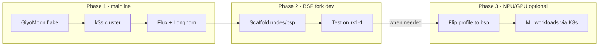

1. **Now:** Bring up cluster on **mainline** (GiyoMoon) — prove k3s, Flux, Longhorn, Traefik.
2. **Parallel (low priority):** Scaffold `nodes/bsp/` fork; no fleet switch yet.
3. **When NPU/GPU needed:** Boot rk1-1 on BSP, validate hardware, then roll profile to remaining nodes.

GiyoMoon remains the **fallback** — if BSP kernel pin breaks, switch `mkHost` back to `"mainline"` and rebuild.

#### NixOS-specific caveats on RK1

| Caveat | Detail |
|--------|--------|
| **Not official Turing path** | No Turing Pi doc for NixOS; you follow community flakes or port U-Boot yourself |
| **k3s on aarch64 NixOS** | Known nixpkgs issues (`k3s-agent` binary missing on some versions — [issue #495013](https://github.com/NixOS/nixpkgs/issues/495013)); pin nixpkgs or use workarounds; verify before committing |
| **Cross-build** | Building from macOS/x86 requires `boot.binfmt.emulatedSystems = [ "aarch64-linux" ]` on a Linux builder or build directly on an RK1 node |
| **Kernel choice tradeoff** | Mainline = cleaner Nix story; Armbian BSP = better Rockchip peripheral support (NPU, etc.) but custom kernel overlay to maintain |
| **First-boot complexity** | NVMe flash is fiddly without removing drives — flash NixOS to eMMC first, `dd` image to NVMe from running node, then replace eMMC with U-Boot-only image (documented in GiyoMoon README) |
| **Maintenance** | You own kernel/U-Boot updates when board support shifts — more ops burden than Ubuntu (see below) |

#### Maintaining the NixOS RK1 port — practical breakdown

Once the cluster boots, most day-to-day work is normal NixOS + k3s ops. The **port** is the RK3588/Turing-specific boot stack that sits *under* NixOS. Here is what you actually touch, how often, and what you can ignore.

##### What you do **not** maintain at the node layer

These live in Flux/K8s and are OS-agnostic — same regardless of Ubuntu, Talos, or NixOS:

- Longhorn, MetalLB, Traefik, Prometheus, Capacitor, Authelia
- Application Helm charts and arm64 image compatibility
- Cluster networking policies and ingress rules

##### RK-specific parts (the port)

| Part | What it is | When you must touch it | Typical effort |
|------|------------|------------------------|----------------|
| **U-Boot + rkbin blobs** | Turing `defconfig`, `BL31`, `ROCKCHIP_TPL` packaged as a Nix derivation | Turing changes boot requirements; U-Boot fails after blob update; you want newer U-Boot features | **Rare** — re-flash small eMMC U-Boot image on 4 nodes; test one node first |
| **Device tree (DTB)** | `rk3588-turing-rk1.dts` — tells kernel about board wiring | Kernel bump breaks boot; Turing hardware revision; new peripheral (unlikely on RK1 SOM) | **Rare** — update DTS in flake, rebuild, redeploy |
| **Kernel** | Mainline via nixpkgs **or** custom Armbian BSP package | Security updates (automatic via nixpkgs pin); boot regression after channel bump; missing driver | **Mainline:** low — usually just pin nixpkgs and `nixos-rebuild`. **BSP:** **moderate/high** — track Armbian branch, rebuild custom kernel |
| **Firmware blobs** | Mali GPU, etc. (only if you enable GPU) | Never for your stack (no GPU workloads planned) | **None** if unused |
| **NVMe boot chain** | U-Boot on eMMC → rootfs on NVMe | Almost never once working | **One-time** unless eMMC corrupted |
| **Board flake upstream** | e.g. `GiyoMoon/nixos-turing-rk1` | Upstream fixes bug you hit; upstream goes stale → you fork | **Low** if following upstream; **moderate** if forked |

**For your homelab (routing + k3s only, no NPU/GPU):** the port effectively reduces to **U-Boot stub on eMMC** + **mainline kernel** + **Turing DTB**. That is a small, stable surface.

##### Generic NixOS node maintenance (not RK-specific)

You maintain these on any NixOS cluster node — same as the OptiPlex router pattern:

| Part | Cadence | Notes |
|------|---------|-------|
| **nixpkgs pin** | Monthly–quarterly | Security patches; test on one RK1 before rolling all 4 |
| **`services.k3s`** | Per k3s release | Version in Nix config; watch [aarch64 k3s regressions](https://github.com/NixOS/nixpkgs/issues/495013) |
| **Node networking** | Rare | Static IPs, VLAN 30, firewall — declarative in `hosts/rk1-*.nix` |
| **Longhorn disk mounts** | One-time + verify on rebuild | Ensure NVMe partition mounted at `/var/lib/longhorn` (or configured path) |
| **sops-nix / age keys** | Per host add/rotate | Same workflow as router |
| **deploy-rs** | Each config change | `deploy .#rk1-1` etc. |

##### What triggers maintenance work

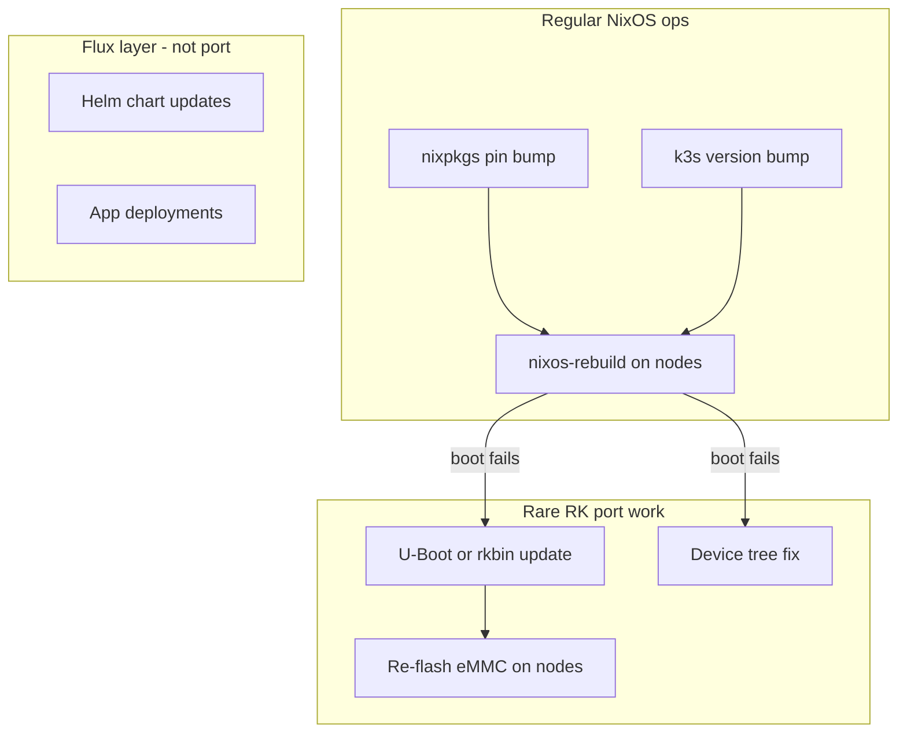

| Trigger | Likely cause | Your action |
|---------|--------------|-------------|
| `nixos-rebuild` fails to boot | Kernel/DTB mismatch after nixpkgs bump | Pin previous nixpkgs; check upstream flake; fix DTB or kernel override |
| k3s service won't start | nixpkgs packaging regression on aarch64 | Pin k3s version; patch `services.k3s` wrapper; track nixpkgs issue |
| Node hangs at U-Boot | Corrupt eMMC stub or wrong image | Re-flash `uboot-turing-rk1` image via BMC/tpi (one node, then rest) |
| Ethernet slow / VLAN broken | Mainline kernel regression (historically needed Rockchip patches) | Switch to BSP kernel overlay **or** add kernel patch to flake |
| GiyoMoon flake archived | Upstream unmaintained | Fork repo; you own U-Boot/kernel packaging going forward |

##### Three maintenance postures (pick one)

| Posture | You maintain | Steady-state effort |
|---------|--------------|---------------------|
| **Follow upstream flake** (recommended start) | Pin `github:GiyoMoon/nixos-turing-rk1`; bump when they do; your `hosts/` + k3s config only | **~1–2 h/quarter** — nixpkgs pin, test rebuild, k3s bump |
| **BSP fork (`nodes/bsp/`)** | Pin Joshua-Riek/linux-rockchip rev; Mali/RKNPU firmware | **~1 day/quarter** when active; **idle** until NPU/GPU needed |
| **Fork GiyoMoon entirely** | Above + U-Boot/kernel derivations when upstream lags | **~half day/quarter** or on-demand when builds break |

##### Compared to Ubuntu and Talos maintenance

| Task | Ubuntu + k3s | Talos | NixOS + k3s (RK1 port) |
|------|--------------|-------|------------------------|
| OS security updates | `apt upgrade` + reboot | `talosctl upgrade` (new image) | `nixos-rebuild` (pin bump) |
| k8s runtime update | Re-run k3s install script or apt | Bundled in Talos image | `services.k3s` version in Nix |
| Boot/firmware | Turing Ubuntu image (vendor) | Sidero Image Factory schematic | **You** (or upstream flake) |
| Config drift | Possible (manual changes) | None (immutable) | None (declarative) |
| Rollback | Manual | Talos rollback | `nixos-rebuild --rollback` |
| RK-specific ops | **Low** — vendor images | **Low** — factory images | **Moderate** — community port |

##### Honest steady-state estimate (mainline + follow GiyoMoon)

After initial bring-up works:

- **Normal months:** `nixos-rebuild` / deploy-rs across 4 nodes when you bump nixpkgs — same rhythm as the router.
- **Rough quarters:** 1–2 hours testing pin bumps on rk1-1 before fleet rollout.
- **Bad quarters:** half day if nixpkgs kernel or k3s aarch64 packaging breaks — pin back, wait for fix or patch flake.
- **Rare events:** re-flash eMMC U-Boot (annual or less).

The port is **not** a weekly chore. It is a **dependency on community board packaging** that occasionally needs attention when the NixOS ecosystem moves faster than RK1 support.

##### Risk mitigation (add to plan regardless of OS choice)

- Pin `nixpkgs` and `turing-rk1` flake inputs explicitly in `flake.lock`
- Roll out OS updates to **rk1-1 first**, then workers
- Keep a **known-good bootable eMMC U-Boot image** and NixOS NVMe snapshot documented in `docs/`
- Document one-node recovery: BMC flash → rejoin k3s


#### Decision factors

**Default: NixOS + k3s** — declarative unity with router, dual profiles for future NPU/GPU.

**Escape to Ubuntu + k3s when:**

- GiyoMoon/NixOS boot fails and you need the [official Turing k3s guide](https://docs.turingpi.com/docs/turing-pi2-kubernetes-installation)
- You need **vendor NPU/GPU immediately** without waiting for the BSP fork
- `services.k3s` aarch64 nixpkgs issues block the cluster

**Escape to Talos when:**

- NixOS port maintenance is too heavy but you still want immutable nodes
- You prefer `talosctl` + official Sidero RK1 docs over community Nix flakes
- k3s is not a requirement (standard K8s is fine)

**Probably does not matter for initial homelab bring-up:**

- NVMe presence — you already have it; all paths benefit

**Deferred until BSP profile is enabled:**

- NPU/GPU workloads — require `bsp` profile and K8s device mounts; not needed for Traefik/Prometheus/Capacitor

#### Practical recommendation

| Priority | Suggestion |
|----------|------------|
| **Cluster bring-up** | NixOS + k3s on **`mainline`** profile (GiyoMoon flake) |
| **NPU/GPU future** | Scaffold `nodes/bsp/` Armbian BSP fork in parallel; switch profile when needed |
| **If NixOS blocks progress** | **Escape hatch A:** Ubuntu 22.04 + k3s. **Escape hatch B:** Talos. Both documented below |

If NixOS nodes are appealing, start on **GiyoMoon mainline**, scaffold the BSP fork without switching the fleet, and flip to `bsp` only when you have a concrete NPU/GPU workload.

#### NVMe boot (all paths — you have NVMe)

- **Ubuntu:** Flash to NVMe via BMC; boot order NVMe > eMMC.
- **Talos:** SPI U-Boot overlay on eMMC; OS on NVMe ([Sidero docs](https://docs.siderolabs.com/talos/v1.8/platform-specific-installations/single-board-computers/turing_rk1)).
- **NixOS:** U-Boot-only image on eMMC; full system on NVMe ([GiyoMoon docs](https://github.com/GiyoMoon/nixos-turing-rk1)).

#### Networking (VLAN 30)

- Static IPs on all nodes (`10.10.30.11–14`) regardless of OS.
- MetalLB L2 pool on same VLAN works identically.

**Current plan default:** NixOS + k3s on **`mainline`** profile (GiyoMoon). Ubuntu and Talos bootstrap steps below are **escape hatches** — cluster layer (Flux, Longhorn, Traefik, MetalLB) stays identical.

### When to switch to an escape hatch

| Trigger | Use escape hatch | Rationale |
|---------|------------------|-----------|
| GiyoMoon/NixOS won't boot after reasonable effort | **Ubuntu + k3s** | Official Turing docs; vendor kernel includes NPU/GPU if needed immediately |
| NixOS works but `services.k3s` aarch64 packaging blocks cluster | **Ubuntu + k3s** | curl-install k3s bypasses nixpkgs packaging issues |
| NixOS port maintenance too heavy; want immutable nodes | **Talos** | Official Sidero RK1 path; no SSH, API-driven |
| NixOS BSP fork for NPU/GPU is blocked | **Ubuntu + k3s** | Easiest proprietary NPU path (vendor kernel) while keeping Flux workloads |

**What transfers unchanged:** `k8s/` Flux manifests, VLAN 30 IP plan, MetalLB pool, Longhorn storage class, Traefik, Prometheus, Capacitor. Only node provisioning and kubeconfig acquisition differ.

**Return path:** Ubuntu/Talos nodes can be migrated back to NixOS later (reflash + rejoin). Workloads in Git (Flux) are unaffected.

### Escape hatch A: Ubuntu 22.04 + k3s

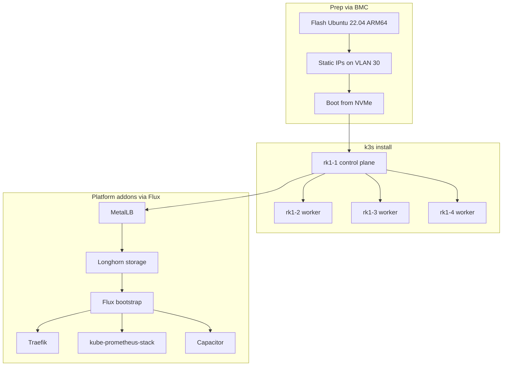

1. **Flash** Ubuntu 22.04 Server ARM64 to each RK1 via [BMC web UI](https://docs.turingpi.com/) (keep bootloader partition intact if dual-booting eMMC).
2. **Configure** static networking, hostnames (`rk1-1`…`rk1-4`), SSH keys, disable swap, enable cgroups.
3. **Install k3s on rk1-1** (control plane):

   ```bash
   curl -sfL https://get.k3s.io | sh -s - \
     --write-kubeconfig-mode 644 \
     --disable servicelb \
     --disable local-storage \
     --disable-cloud-controller \
     --node-ip 10.10.30.11 \
     --tls-san 10.10.30.11 \
     --cluster-init
   ```

   Use `--cluster-init` only if planning HA; for single CP, omit it.

4. **Join workers** on rk1-2..4:

   ```bash
   curl -sfL https://get.k3s.io | K3S_URL=https://10.10.30.11:6443 K3S_TOKEN=<token> sh -
   ```

5. **Verify:** `kubectl get nodes` — all 4 `Ready`.

6. **MetalLB** — L2 pool `10.10.30.100–110` for `LoadBalancer` Services (Traefik).

7. **Longhorn** — replicated persistent volumes across worker NVMe (avoid eMMC for PV).

8. **Flux bootstrap** from `net` repo:

   ```bash
   flux bootstrap github --owner=<you> --repository=net --path=k8s/clusters/homelab
   ```

9. **HelmReleases** (via Flux): Traefik, kube-prometheus-stack, Capacitor; pin **arm64** image tags where needed.

10. **kubeconfig** — store on trusted machine; use via WireGuard; SOPS-encrypt any tokens in Git.

### Escape hatch B: Talos Linux

Use when you want **immutable API-driven nodes** without maintaining the NixOS RK1 port. Cluster layer (Flux, Longhorn, Traefik) is identical; runtime is standard Kubernetes (not k3s).

1. **Generate image** — [Talos Image Factory](https://factory.talos.dev): Single Board Computers → **Turing RK1**; add `sbc-rockchip` extension; download `metal-turing_rk1-arm64.raw`.
2. **NVMe boot** — Flash SPI U-Boot overlay to eMMC per [Sidero RK1 docs](https://docs.siderolabs.com/talos/v1.8/platform-specific-installations/single-board-computers/turing_rk1); install Talos to NVMe.
3. **Machine config** — static IPs `10.10.30.11–14` on VLAN 30; store in Git (`nodes/talos/` or `docs/runbooks/`).
4. **Bootstrap cluster** — `talosctl bootstrap` on rk1-1; join rk1-2..4 with generated configs.
5. **Flux bootstrap** — same `k8s/clusters/homelab` path; Traefik/MetalLB/Longhorn HelmReleases unchanged.
6. **CNI / storage** — Cilium or default CNI; Longhorn on NVMe (same PVC definitions).

**Talos tradeoffs vs NixOS:** no sops-nix on nodes (use SOPS + Flux only); no k3s (full K8s); NPU/GPU not available on Talos RK1. **Return path:** reflash to NixOS or Ubuntu later; Flux workloads unaffected.

### ARM64 / resource cautions

- **Image arch:** Verify all container images support `linux/arm64` (Traefik, Prometheus, Grafana, Authelia, Capacitor — check before deploy).
- **RAM:** 32 GB per node — no memory bottleneck for homelab workloads; still avoid overcommitting Prometheus/Longhorn limits in Helm values.
- **Storage:** 32 GB eMMC fills quickly — **NVMe is effectively required** for workers and Longhorn.
- **Thermals:** RK1 throttles under sustained load; ensure case airflow; monitor `node_exporter` thermals.
- **Traefik LB:** MetalLB L2 on VLAN 30; Caddy proxies `zdk.no` to Traefik LB IP on HTTP.

### Turing Pi on the network

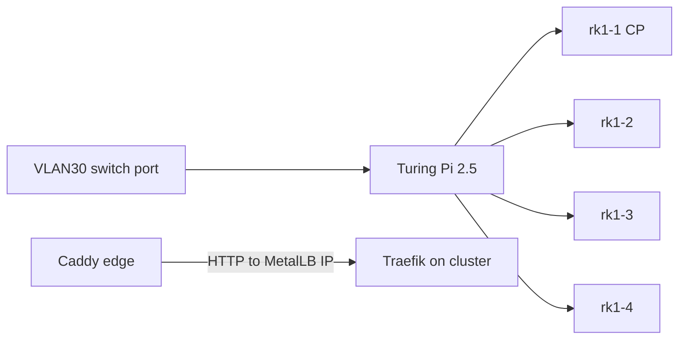

- Firewall: allow **trusted VLAN + VPN → k8s API 6443**; allow **Caddy → MetalLB Traefik port**; deny IoT/guest → cluster.
- BMC management from mgmt VLAN only.

### Repo layout for cluster

```
k8s/clusters/homelab/
├── flux-system/
├── infrastructure/
│   ├── metallb/
│   ├── longhorn/
│   ├── traefik/
│   ├── monitoring/       # kube-prometheus-stack
│   └── capacitor/
└── apps/
```

### Stage 5 additions (cluster-specific)

**NixOS path (preferred — `mainline` profile):**

- [ ] Flash GiyoMoon U-Boot stub to eMMC; NixOS rootfs to NVMe on all 4 RK1s.
- [ ] Deploy `nodes/` flake (`profile = mainline`); static IPs on VLAN 30.
- [ ] k3s cluster via `services.k3s` (1 CP + 3 workers); pin nixpkgs + test aarch64 k3s.
- [ ] Flux bootstrap; MetalLB + Longhorn + Traefik + kube-prometheus-stack.
- [ ] Deploy self-hosted Capacitor; expose via Caddy + Authelia (VPN/trusted VLAN).
- [ ] Confirm arm64 image compatibility for all platform pods.

**BSP fork (parallel, non-blocking):**

- [ ] Scaffold `nodes/bsp/` per Armbian BSP fork setup plan.
- [ ] Boot-test `bsp` profile on rk1-1 only; validate GPU/NPU devices.
- [ ] Switch fleet to `bsp` only when an NPU/GPU workload is planned.

**Fallback (escape hatches — keep documented, use only if NixOS blocks):**

- **A: Ubuntu 22.04 + k3s** — BMC flash; official Turing path (steps below).
- **B: Talos** — Sidero Image Factory + `talosctl` bootstrap (steps below).
- Flux/k8s layer identical in all cases.

### Adding x86 nodes later (heterogeneous cluster)

**Yes — you can join amd64/x86 machines to the same k3s cluster as workers.** Kubernetes supports mixed-architecture clusters natively.

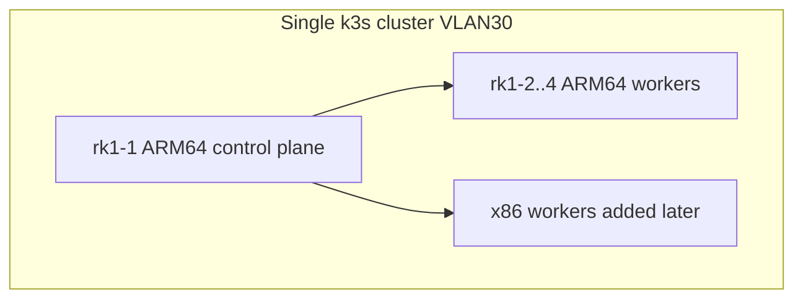

#### How to add an x86 node

1. Install Ubuntu (or your preferred Linux) on the x86 host; static IP on VLAN 30.
2. Join with the same k3s agent command used for RK1 workers:

   ```bash
   curl -sfL https://get.k3s.io | K3S_URL=https://10.10.30.11:6443 K3S_TOKEN=<token> sh -
   ```

3. **Label the node** for architecture-aware scheduling:

   ```bash
   kubectl label node <x86-hostname> kubernetes.io/arch=amd64
   kubectl label node rk1-2 kubernetes.io/arch=arm64
   # ... repeat for each node (k3s may set this automatically — verify)
   ```

4. Longhorn and MetalLB work across architectures; no separate cluster needed.

#### What to watch for

| Topic | Guidance |
|-------|----------|
| **Container images** | Prefer **multi-arch** images (manifest lists). Single-arch images only run on matching nodes. |
| **Workload placement** | Use `nodeSelector: kubernetes.io/arch: amd64` (or `arm64`) when an app lacks multi-arch support. |
| **DaemonSets** | Platform DaemonSets (Longhorn, node_exporter, CNI) need **multi-arch** images or separate manifests per arch. Most mainstream charts handle this. |
| **Helm values** | Some charts expose `nodeSelector` / `affinity` — pin heavy x86-only apps to amd64 nodes. |
| **Control plane** | Can stay on RK1; x86 nodes join as workers only. Moving CP to x86 later is possible but disruptive — not required. |
| **Storage** | Longhorn replicas can live on any node; set **data locality** or replica preferences if an app should stay near its PV. |
| **Network** | Same VLAN 30 L2 — MetalLB L2 mode works across ARM and x86 nodes. |

#### Suggested node labels (from day one)

```yaml
# Apply via kubectl or Flux Kustomize
kubernetes.io/arch: arm64|amd64   # usually automatic
node.kubernetes.io/role: worker
homelab/node-type: rk1|x86        # custom — for your own scheduling rules
```

#### When x86 nodes help

- Apps without ARM builds (legacy binaries, some commercial images)
- Heavier workloads where you want more CPU single-thread performance
- Dedicated x86 worker for CI/build pods (`amd64` only)
- Freeing RK1 nodes for ARM-native or power-efficient workloads

#### What not to do

- Do not create a **separate** cluster for x86 unless you have a strong isolation reason — one cluster with arch labels is simpler with Flux/Caddy/Traefik.
- Do not assume all images are multi-arch — verify before deploying ( `docker manifest inspect <image>` ).

---

## Auth: Authelia (confirmed)

VLANs require **managed** switching and APs with SSID-to-VLAN mapping. Prices below are indicative NOK incl. 25% MVA (March 2026); check [Prisjakt](https://www.prisjakt.no) before buying.

### Where to buy in Norway

| Retailer | Good for | Notes |
|----------|----------|-------|
| [avXperten.no](https://www.avxperten.no) | MikroTik, Ubiquiti, networking | No extra toll; fast shipping |
| [Senetic.no](https://www.senetic.no) | MikroTik, Ubiquiti, enterprise | Ships to Norway; netto/brutto pricing |
| [Komplett.no](https://www.komplett.no) | UniFi APs, UPS, general IT | Wide selection |
| [Dustin.no](https://www.dustin.no) | MikroTik, business IT | B2B; often good MikroTik stock |
| [Mobit.no](https://www.mobit.no) | Omada switches/APs | Networking specialist |
| [Finn.no](https://www.finn.no) | Used ThinkCentre Tiny, Dell Micro | Budget router builds |
| AliExpress / Topton direct | Fanless N100 router boxes | Cheapest router; add ~25% MVA/toll on import; 2–4 week delivery |

**Import note:** Protectli ships to Norway from the US ([protectli.com](https://protectli.com/shipping/worldwide/)) — expect shipping + Norwegian import fees on top of USD price. Protectli EU ([eu.protectli.com](https://eu.protectli.com)) offers free EU shipping but **does not deliver to Norway** (EFTA, not EU).

### DIY router (NixOS)

| Tier | Example hardware | NICs | NOK (approx.) | Where to buy (NO) |
|------|------------------|------|---------------|-------------------|
| **Chosen (on hand)** | **Dell OptiPlex 9020 MT** + optional Intel PCIe NIC | 1× I217LM + 1–2 Intel | **0** + ~500 NIC | Already owned |
| **Budget** | Used Lenovo ThinkCentre M720q/M920q + Intel PCIe NIC | 1 onboard + 1–2 Intel | 1 500–3 000 | Finn.no |
| **Recommended** | Topton N100 4× i226-V 2.5G, 8 GB RAM, 128 GB NVMe | 4× Intel 2.5G | 2 000–2 800 (incl. import) | AliExpress / Topton |
| **Premium** | Protectli VP2420 (4× 2.5G Intel) | 4× Intel 2.5G | 4 500–6 000 (incl. import) | protectli.com |
| **Overkill** | Topton N305 4× i226 | 4× 2.5G | 3 500–4 500 | AliExpress |

**Router selection criteria:**

- **Intel NICs** (i225, i226, i350) — best NixOS/Linux support; verify model before buying Topton.
- **4-port Topton** — WAN + LAN trunk on one NIC, or dedicated ports per segment; more flexible than 2-port.
- **RAM:** 8 GB recommended; 4 GB minimum for routing only.
- **AES-NI** — all N100/N305 CPUs have it; fine for 1 Gbps WireGuard.
- **No WiFi on router** — external AP only.

**Norwegian ISP note:** Most Norwegian fibre (Telenor, Altibox, etc.) delivers 1 Gbps or less. An OptiPlex 9020 or N100 with Intel NICs handles this with headroom. 2.5G NICs future-proof if you upgrade LAN later.

### Dell OptiPlex 9020 MT — confirmed router hardware

**Confirmed:** Mini Tower (MT) chassis — full-height PCIe x16 and x1 slots; ideal for a dedicated WAN + LAN trunk layout.

| Spec | OptiPlex 9020 MT | Fit for your plan |
|------|------------------|-------------------|
| **Onboard NIC** | Intel **I217LM** 1 GbE | WAN port (modem/ONT) |
| **CPU** | Haswell i5/i7 (4th gen) | AES-NI for WireGuard; far more than needed for 1 Gbps routing |
| **RAM** | Up to 32 GB DDR3 | 8 GB is plenty for router + Unbound + DNSUpdater |
| **Expansion** | Full-height PCIe x16 + x1 | Add **Intel i350-T2** dual-port (~500–800 NOK used) for LAN trunk + spare |
| **Power** | ~25–45 W typical | Higher than Topton (~10 W) but acceptable on UPS |
| **Noise** | Active fan | Louder than fanless N100; tune fan curves in BIOS |

**Recommended cabling (MT with add-on NIC):**

1. **Onboard I217LM** → ISP modem/ONT (WAN).
2. **PCIe Intel i350 port 1** → CRS310 trunk (all VLANs tagged).
3. **PCIe i350 port 2** — spare (mgmt laptop, second switch, or future DMZ).

| **Alternative (not used):** Router-on-a-stick — single onboard NIC to CRS310 trunk; WAN via VLAN subinterface on trunk. Works fine; you chose dedicated WAN + i350 trunk instead.

**Also needed:**

- Small SSD (64–128 GB) for NixOS — likely already in the machine.
- No WiFi on router — Ubiquiti AP handles WiFi.

**9020 MT vs buying Topton N100 (reference only):**

| | OptiPlex 9020 | Topton N100 |
|---|---------------|-------------|
| Cost | **0 NOK** (already owned) + ~500 NOK NIC optional | ~2 500 NOK |
| Power | Higher | Lower |
| NICs | 1 onboard + PCIe add-on | 2–4 onboard 2.5G |
| 2.5G LAN | Via CRS310 ports to desktops | Native on router |
| Reliability | Proven business desktop | Depends on AliExpress QC |

**Chosen BOM with 9020 MT:** ~4 800 NOK (CRS310 + U6+ + PoE injector + optional i350-T2 — no router purchase).

---

**Chosen:** [CRS310-8G+2S+IN](https://mikrotik.com/product/crs310_8g_2s_in) — ~2 200 NOK (avXperten, Dustin, Prisradar).

| Spec | Detail |
|------|--------|
| Ports | 8× 2.5GbE RJ45 + 2× 10G SFP+ |
| PoE | **No** — use PoE injector (~300 NOK) for Ubiquiti U6+ |
| VLANs | 802.1Q — SwitchOS (simple L2) or RouterOS (advanced) |
| Monitoring | SNMP for `snmp_exporter` on Prometheus |
| Fit for flat | 8 ports: router trunk, AP, Turing Pi, 4–5 wired |

**Port plan:** See **Device inventory → CRS310 port plan** (TrueNAS port 4, Pingu port 6, Zpi port 5).

**CRS310 notes:**

- Use **SwitchOS** for pure L2 switching, or **RouterOS** for scripting/SNMP — both support VLANs.
- Trunk ports carry all SSID VLANs to the AP; access ports carry one untagged VLAN.
- Export config periodically to `docs/switch/` (RouterOS `/export`) for backup.
- 2.5G ports future-proof LAN; Turing Pi uplink is 1 GbE (auto-negotiates).

### WiFi access points

~60 m² is well within a single AP. If your current AP already supports **multiple SSIDs with VLAN IDs** (802.1Q), keep it. Otherwise replace with a VLAN-capable model.

| Model | Coverage | VLAN SSIDs | PoE | NOK (approx.) | Notes |
|-------|----------|------------|-----|---------------|-------|
| **Ubiquiti U6+** | ~140 m² | Yes | 9 W | ~1 200–1 550 | Best fit for your flat; compact |
| **Ubiquiti U6 Pro** | ~160 m² | Yes | 13 W | ~2 000–2 500 | If you want more headroom |
| **Ubiquiti U6-LR** | ~185 m² | Yes | 16 W | ~2 400–3 000 | Overkill for 60 m² |
| **TP-Link Omada EAP613** | ~120 m² | Yes | 12 W | ~1 200–1 600 | Good UniFi alternative |

**Recommendation:** **Ubiquiti U6+** (~1 300 NOK) — sufficient for 60 m². **UniFi Network Application** — Docker on TrueNAS (confirmed).

PoE injector (~300 NOK) **required** — CRS310 has no PoE.

### Other hardware

| Item | Example | NOK (approx.) | Retailer |
|------|---------|---------------|----------|
| UPS | APC Back-UPS 700–1000 VA | 900–1 500 | Komplett, Dustin |
| PoE injector | Ubiquiti PoE-48-24W-G | ~300 | avXperten | Required — CRS310 has no PoE |
| Console cable | USB serial for router recovery | ~150 | Amazon.de / Komplett |

### Example BOM — Norway, ~60 m² flat (9020 MT)

| Item | Model | NOK (approx.) |
|------|-------|---------------|
| Router | Dell OptiPlex 9020 MT (owned) + optional Intel i350-T2 | 0 (+ ~500) |
| Switch | MikroTik CRS310-8G+2S+IN | 2 200 |
| AP | Ubiquiti U6+ (1×) | 1 300 |
| PoE injector | Ubiquiti PoE-48-24W-G | 300 |
| UPS | APC 700 VA | 1 000 |
| **Total** | | **~4 300–4 800 NOK** |

**Alternate BOM (if not using 9020):** Topton N100 4-port (~2 500) + same switch/AP/PoE/UPS → **~7 300 NOK**.

**Premium variant** (~9 800 NOK): Protectli VP2420 (~5 500) + CRS310 (~2 200) + U6+ (~1 300) + PoE injector (~300) + UPS (~1 000).

---

## WAN access: dynamic public IP (your setup)

You have a **dynamic but public** IPv4 address — this is the straightforward case. No CGNAT workarounds needed.

### What to configure on NixOS

1. **Port forward on router:** WAN 443/tcp (+ 80/tcp for ACME) → **TrueNAS `10.10.30.20`**; WAN UDP 51820 → WireGuard.
2. **DDNS:** [DNSUpdater](https://github.com/sknutsen/DNSUpdater) via `systemd.timer` on router (see DDNS section).
3. **DNS records:** Public `A` record with low TTL (300–600 s).
4. **Verify not CGNAT:** Router WAN IP should match [whatismyip.com](https://whatismyip.com).

### Norwegian ISP tips

- Altibox, Telenor, Telia fibre typically provide dynamic public IPv4 + IPv6 prefix delegation — enable IPv6 as well for resilience.
- Static IP is usually a paid add-on (~50–100 NOK/month) — **not required** for your DDNS approach.
- Bridge ISP modem/router to your NixOS router to avoid double NAT.

---

## CGNAT: options and trade-offs (reference)

**Your situation:** You are **not** behind CGNAT. This section is reference if you move or ISP changes policy.

CGNAT means no unique public IPv4 — inbound port forwarding cannot work. Detect: compare router WAN IP to whatismyip.com; if they differ, or WAN is `100.64.x.x`, you are behind CGNAT.

### Option 1: IPv6 (best, self-hosted)

If your ISP delegates a `/56` or `/64` prefix:

- Enable IPv6 on NixOS WAN; assign per-VLAN subnets.
- Publish `AAAA` records for public services; open **WAN firewall for 443/80 on IPv6 only**.
- WireGuard can run over IPv6 too.
- **Caveat:** Some IoT devices ignore IPv6 (fine — they stay on IPv4 outbound only). Verify ISP IPv6 stability and prefix delegation.

### Option 2: ISP business/residential static IP (paid upgrade)

- Request a **public IPv4** (static or dynamic but non-CGNAT) from ISP — often €5–15/month.
- Simplest path for inbound 443 + WireGuard on IPv4.
- **Best if** you need reliable inbound access without tunnels.

### Option 3: WireGuard-only admin (no public services)

- Do not expose Caddy to the internet on IPv4.
- Admin via WireGuard only; public services hosted elsewhere or not offered.
- **Best if** external access is admin-only and you want zero inbound attack surface.

### Option 4: Self-hosted reverse tunnel (IPv4 egress)

Your homelab initiates an **outbound** connection to a VPS with a public IP; traffic flows back through the tunnel.

| Tool | How it works | Pros | Cons |
|------|--------------|------|------|
| **[frp](https://github.com/fatedier/frp)** | Client on LAN → frps on VPS; proxy TCP 443 | Simple, fast, self-hosted | You pay for VPS; VPS is a trust point |
| **[rathole](https://github.com/rapiz1/rathole)** | Similar to frp, Rust | Lightweight | Smaller ecosystem |
| **[WireGuard site-to-site](https://www.wireguard.com/)** | LAN router ↔ VPS; Caddy on VPS or DNAT | Uses existing WG stack | More manual routing; VPS still required |
| **Self-hosted Headscale** | Mesh overlay; optional exit nodes | No port forward needed | Public services still need a reachable entry (VPS or IPv6) |

**Architecture with VPS tunnel:**


- Rent a small VPS (Hetzner, OVH — €4–6/month).
- Tunnel only 443 (and WireGuard if desired) — do not expose entire LAN.
- mTLS or WireGuard between VPS and homelab for tunnel encryption.

### Option 5: Self-hosted DDNS (only works without CGNAT)

- [ddclient](https://github.com/ddclient/ddclient) + registrar API — updates DNS when your **public** IP changes.
- **Does not solve CGNAT** — only useful once you have a real public IPv4 (Option 2) or for IPv6 dynamic updates.

### Options to avoid (vendor/SaaS)

- Cloudflare Tunnel, ngrok, Tailscale Funnel — convenient but violate self-hosted preference.
- UPnP/NAT-PMP — will not work through CGNAT anyway.

### Recommended CGNAT decision tree

1. **ISP offers IPv6 with prefix delegation?** → Use IPv6 for public ingress + WireGuard; keep IPv4 for legacy outbound.
2. **Need reliable IPv4 inbound?** → Pay ISP for non-CGNAT address.
3. **Admin only, no public apps?** → WireGuard-only; skip public Caddy.
4. **Public apps on IPv4, no ISP upgrade?** → Small VPS + frp/rathole or WireGuard site-to-site; Caddy stays on LAN.
5. **Never** → SaaS tunnel as default.

---

## K8s GitOps: Flux + Capacitor (confirmed)

**Flux** handles declarative sync from Git (HelmReleases for Traefik, kube-prometheus-stack; Kustomizations for apps). **Capacitor** provides the visual dashboard Flux lacks natively.

### Flux setup

- Bootstrap: `flux bootstrap github --owner=<you> --repository=net --path=k8s/clusters/homelab`
- Secrets: SOPS + age via [Flux Mozilla SOPS guide](https://fluxcd.io/flux/guides/mozilla-sops/)
- Notifications: Flux Alert provider → webhook or email on sync failure
- CLI day-to-day: `flux get kustomizations -A`, `flux reconcile helmrelease <name>`

### Capacitor setup (self-hosted, confirmed)

Capacitor runs **in-cluster** on VLAN 30, exposed through Caddy with Authelia forward-auth. No local kubeconfig required for day-to-day use.

#### Deployment

- Deploy via Helm or static manifests in `k8s/clusters/homelab/infrastructure/capacitor/` (managed by Flux).
- Capacitor needs read access to the Kubernetes API and Flux CRDs — use a dedicated `ServiceAccount` with minimal RBAC (get/list/watch on Flux resources).
- Run in `flux-system` or a dedicated `capacitor` namespace.

#### Authentication and access

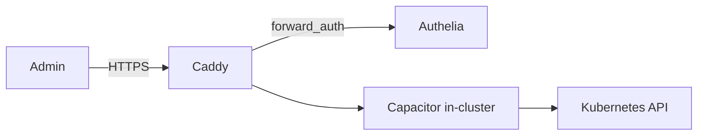

| Layer | Config |
|-------|--------|
| **Auth** | `AUTH=trusted_proxy` — Caddy passes Authelia headers after forward-auth |
| **Exposure** | Internal hostname only (e.g. `capacitor.internal.example.com`) — **not** on public WAN |
| **Access paths** | Trusted VLAN (20) or WireGuard VPN; block WAN → Capacitor entirely |
| **Caddy** | `reverse_proxy` to Capacitor Service; `forward_auth` to Authelia |

**Do not** expose Capacitor on the public internet — it is an admin control plane. VPN-first access is consistent with the rest of the plan.

#### Caddy snippet (example)

```
capacitor.internal.example.com {
    forward_auth authelia:9091 { ... }
    reverse_proxy capacitor.flux-system.svc.cluster.local:9000
}
```

#### Capacitor features you will use

- Kustomization and HelmRelease status at a glance
- Git ↔ cluster diff for Helm values and manifests
- Helm release history and rollback
- Multi-cluster context switching (if you add clusters later)

Capacitor does **not** replace `kubectl logs` for arbitrary pod debugging — keep `kubectl` / stern for that. Use Grafana for ongoing pod health metrics.

### Repo layout

```
k8s/clusters/homelab/
├── flux-system/              # bootstrap-generated
├── infrastructure/
│   ├── traefik/              # HelmRelease + values
│   ├── monitoring/           # kube-prometheus-stack HelmRelease
│   ├── capacitor/            # self-hosted Capacitor deployment
│   └── cert-manager/         # if not using Caddy for internal TLS
└── apps/                     # your application Kustomizations
```

### ArgoCD (not chosen, for reference)

ArgoCD provides a heavier all-in-one control plane with built-in UI, multi-cluster management, and SSO. Not needed given Flux + Capacitor covers your visibility requirements with a lighter footprint.

---

## Flux vs ArgoCD (reference)

Both sync Kubernetes state from Git. Either fits a self-hosted, declarative homelab. The choice is operational style, not capability.

### At a glance

| Aspect | Flux | ArgoCD |
|--------|------|--------|
| **Architecture** | Modular controllers (source, kustomize, helm, notification) | Single application controller + API server + UI |
| **UI** | Minimal built-in; use Grafana or [Capacitor](https://fluxcd.io/flux/cmd/capacitor/) | Rich web UI out of the box |
| **Git model** | Native Kustomize/Helm; one repo or multi-repo | Application CRD per app; app-of-apps pattern |
| **Helm** | First-class via `HelmRelease` CRD | Native Helm support in Application spec |
| **Learning curve** | Steeper initially (CRD-heavy) | Easier if you like clicking UI to debug |
| **Resource usage** | Lighter (fewer pods by default) | Heavier (UI + redis + repo-server) |
| **Multi-cluster** | `flux bootstrap` per cluster; cluster API | Single ArgoCD can manage multiple clusters |
| **Secrets** | SOPS with [Mozilla SOPS](https://fluxcd.io/flux/guides/mozilla-sops/) + age | SOPS, Sealed Secrets, External Secrets |
| **NixOS alignment** | Strong — everything is declarative YAML/CRDs, no UI required | Strong — Git is source of truth, UI is optional |
| **CNCF** | Graduated | Graduated (via Argo project) |

### When Flux fits better

- You want **pure GitOps with no UI dependency** — matches NixOS philosophy.
- You already use **Helm charts** (Traefik, kube-prometheus-stack) and want `HelmRelease` in Git.
- You prefer **composable controllers** and smaller footprint on small clusters.
- You are comfortable debugging with `flux get`, `kubectl`, and logs.
- **Homelab sweet spot:** single cluster, declarative manifests in `k8s/clusters/`, SOPS for secrets.

### When ArgoCD fits better

- You want a **visual dashboard** to see sync status, diffs, and rollback per app.
- You run **multiple clusters** and want one pane of glass.
- You prefer the **Application CRD** model (one Argo app per service).
- On-call debugging benefits from UI drill-down (pod logs, sync history).
- Team members are less CLI-comfortable.

### Practical homelab recommendation

**Confirmed: Flux + Capacitor** — declarative GitOps with CLI-first workflow, plus Capacitor for visual sync status and Helm diffs when needed.

### What you miss with Flux alone (Capacitor closes most gaps)

Flux has **no first-party web UI**. Nothing is lost in terms of GitOps capability — sync, rollback, and drift detection all work — but the **operational visibility layer** is different. Here is what ArgoCD gives you out of the box that Flux does not:

| Feature | ArgoCD UI | Flux (CLI only) | Flux + [Capacitor](https://fluxcd.io/flux/cmd/capacitor/) (self-hosted) |
|---------|-----------|-----------------|----------------------------------------------------------------------|
| Live resource tree (App → Deployment → Pod) | Yes, colour-coded health | `kubectl get` / `flux tree` | Yes |
| Git ↔ cluster diff view | Visual side-by-side | `flux diff` in terminal | Yes, with Helm values diff |
| One-click sync / rollback | Yes | `flux reconcile` / Helm rollback CLI | Rollback yes; sync via reconcile |
| Sync history timeline | Per-app audit trail in UI | Kubernetes events + Git log | Partial |
| Pod logs from UI | Click pod → logs | `kubectl logs` | No (still kubectl) |
| Per-app health aggregation | Healthy / Degraded / Missing | `flux get kustomizations -A` | Status badges |
| Multi-cluster dashboard | Single ArgoCD, many clusters | Per-cluster context switch | Multi-kubeconfig in Capacitor |
| SSO / RBAC in UI | Built-in (Dex, OIDC) | Kubernetes RBAC only | Trusted-proxy auth if self-hosted |
| Resource relationship graph | Interactive dependency map | None native | Basic tree view |
| Manual "change target revision" | Dropdown in UI | Edit Git + reconcile | Limited |
| Image / manifest promotion visibility | Argo CD Image Updater plugin | Flux Image Automation (CRD) | Capacitor shows ImagePolicy |

**What you are NOT missing** (Flux does these equally well):

- Declarative Git-as-source-of-truth
- Helm chart lifecycle (`HelmRelease` with rollbacks)
- SOPS-encrypted secrets in Git
- Drift detection and auto-reconciliation
- Multi-tenancy via Kubernetes RBAC + namespaces
- Notification on sync failure (Flux Alert provider → Slack/email/webhook)

**Practical impact for a solo homelab operator:**

- **Day-to-day:** You will use `flux get kustomizations`, `flux get helmreleases`, `kubectl describe`, and Grafana dashboards instead of clicking an app graph. Slightly more CLI, same information.
- **Debugging a failed deploy:** ArgoCD lets you click through Pod → Events → Logs in one browser tab. With Flux, that is 3–4 terminal commands (or kubectl + stern). Capacitor closes most of this gap for Flux resources specifically, but not general pod logs.
- **Showing status to someone else:** ArgoCD's UI is self-explanatory. Flux requires you to share terminal output or Grafana panels.
- **Mitigation:** **Capacitor** (self-hosted, confirmed) behind Caddy/Authelia — plus Grafana from kube-prometheus-stack for pod health.

**Bottom line:** Flux + Capacitor gives you declarative GitOps with practical visual tooling, without ArgoCD's heavier control plane.

### Hybrid note

Running Flux and ArgoCD together is unnecessary. Non-K8s services (Caddy, NixOS) stay in `services/` and `router/` in the same repo.

### Repo layout (legacy ArgoCD reference — not used)

```
k8s/clusters/homelab/
├── bootstrap/          # ArgoCD install + app-of-apps
├── infrastructure/     # Traefik, monitoring Applications
└── apps/
```

