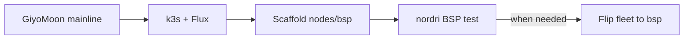

# RK1 BSP fork plan (deferred)

Optional NixOS kernel profile for NPU/GPU on Turing RK1. **Not required for initial cluster bring-up.** Default path is GiyoMoon mainline — see [decisions.md](../decisions.md).

## When to pursue

- ML inference workloads need RKNPU
- GPU (Mali G610) required and mainline Panthor insufficient
- Mainline kernel lacks a required Rockchip driver

**Until then:** Scaffold `nodes/bsp/` in parallel; do not switch fleet profile.

## Architecture

| Layer | GiyoMoon (mainline) | BSP fork |
|-------|---------------------|----------|
| U-Boot eMMC stub | GiyoMoon flake | **Shared** |
| Kernel | NixOS stable mainline | Joshua-Riek/linux-rockchip vendor |
| DTB | Mainline Turing RK1 | Vendor `rk3588-turing-rk1.dtsi` |
| GPU | Limited | Mali G610 via BSP + firmware |
| NPU | Not available | RKNPU driver + container runtime |

**Rule:** One profile per fleet — do not mix mainline and BSP nodes in the same k3s cluster.

## Source of truth

| Component | Source |
|-----------|--------|
| Kernel | [Joshua-Riek/linux-rockchip](https://github.com/Joshua-Riek/linux-rockchip) |
| U-Boot | Reuse GiyoMoon `uboot-turing-rk1` |
| Mali firmware | Armbian/Rockchip blobs in Nix derivation |
| RKNPU userspace | Container image preferred over host install |

## Directory structure

```
nodes/bsp/
├── flake.nix
├── pkgs/kernel/vendor.nix
├── pkgs/firmware/mali-g610.nix
├── modules/boards/turing-rk1.nix
└── README.md
```

Parent `nodes/flake.nix` selects profile per host: `"mainline"` (default) or `"bsp"`.

## Phases

1. **Scaffold** — vendor.nix pinned to linux-rockchip release; no hardware required.
2. **Boot test** — nordri only; NVMe rootfs; roll back to mainline if fails.
3. **Hardware validation** — `/dev/dri`, RKNPU module, thermals, k3s join.
4. **K8s workloads** — `nodeSelector: homelab/kernel-profile: bsp`; inference in containers.
5. **Maintenance** — quarterly kernel pin bumps; document in `nodes/bsp/README.md`.

## Bring-up sequence



1. Cluster on **mainline** first — prove k3s, Flux, Longhorn, Traefik.
2. Parallel low-priority BSP scaffold.
3. Switch profile only when NPU/GPU workload is planned.

## Escape hatch

If BSP blocks progress, revert `mkHost` to `"mainline"` and rebuild. Ubuntu/Talos paths: [escape-hatches-ubuntu-talos.md](../reference/escape-hatches-ubuntu-talos.md).

## Maintenance effort

| Posture | Steady-state |
|---------|--------------|
| Follow GiyoMoon mainline | ~1–2 h/quarter |
| Active BSP fork | ~1 day/quarter when NPU/GPU in use |
| Fork GiyoMoon entirely | ~half day/quarter on-demand |

Full packaging detail (vendor.nix sketches, DTB names, test checklist) to be expanded when BSP work starts.
