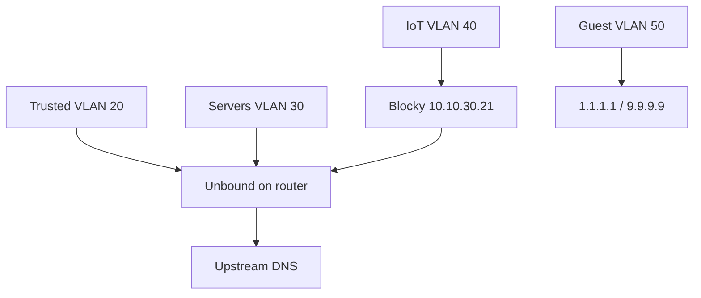

# VLAN plan

IP addressing, DHCP pools, IPv6 layout, and DNS policy. Firewall rules:
[firewall-matrix.md](firewall-matrix.md). Device list:
[inventory.md](inventory.md).

## VLAN table

| VLAN ID | Name    | IPv4 subnet     | Gateway      | Purpose                    |
| ------- | ------- | --------------- | ------------ | -------------------------- |
| 10      | mgmt    | `10.10.10.0/24` | `10.10.10.1` | Switch/AP/BMC management   |
| 20      | trusted | `10.10.20.0/24` | `10.10.20.1` | User devices (SSID `Home`) |
| 30      | servers | `10.10.30.0/24` | `10.10.30.1` | Homelab, TrueNAS, k8s      |
| 40      | iot     | `10.10.40.0/24` | `10.10.40.1` | IoT devices (SSID `IoT`)   |
| 50      | guest   | `10.10.50.0/24` | `10.10.50.1` | Visitors (SSID `Guest`)    |

**Rejected:** VLAN 99 wan-bridge — not needed with dedicated WAN NIC.

## Static IP allocations (VLAN 30)

| IP                 | Host         | Role                                                                |
| ------------------ | ------------ | ------------------------------------------------------------------- |
| `10.10.30.10`      | _(reserved)_ | k8s API VIP — reserved for future kube-vip; API at `nordri` `.11:6443` |
| `10.10.30.11`      | nordri       | k3s control plane                                                   |
| `10.10.30.12`      | sudri        | k3s worker                                                          |
| `10.10.30.13`      | austri       | k3s worker                                                          |
| `10.10.30.14`      | vestri       | k3s worker                                                          |
| `10.10.30.15`      | zpi          | Audio casting (RPi 5)                                               |
| `10.10.30.20`      | truenas      | Caddy, HA, Forgejo, Authelia, Blocky                                |
| `10.10.30.21`      | blocky       | IoT DNS filter (TrueNAS Docker) — recommended                       |
| `10.10.30.100`     | traefik-lb   | Traefik LoadBalancer (MetalLB)                                      |
| `10.10.30.101–110` | —            | MetalLB pool spare                                                  |

## DHCP pools (dnsmasq on router)

| VLAN       | Pool        | Lease time               |
| ---------- | ----------- | ------------------------ |
| 10 mgmt    | `.100–.200` | 24 h                     |
| 20 trusted | `.100–.250` | 24 h                     |
| 30 servers | `.22–.50`   | 24 h (most hosts static) |
| 40 iot     | `.100–.250` | 1 h                      |
| 50 guest   | `.100–.250` | 1 h                      |

**DHCP options:** push Unbound (`10.10.x.1`) as DNS; domain `lab.zdk.no`.

## WiFi mapping (UniFi OS Server on router)

| SSID                    | VLAN | Isolation                  |
| ----------------------- | ---- | -------------------------- |
| `Hai-Fi Wai-Fi`         | 20   | WPA3 where supported       |
| `Hai-Fi Wai-Fi (IoT)`   | 40   | 2.4 GHz for legacy devices |
| `Hai-Fi Wai-Fi (Guest)` | 50   | Client isolation ON        |

## Switch ports (CRS310)

| Port | Mode   | VLAN | Device                 |
| ---- | ------ | ---- | ---------------------- |
| 1    | trunk  | all  | OptiPlex i350 (router) |
| 2    | trunk  | all  | Ubiquiti U7 Lite       |
| 3    | access | 30   | Turing Pi 2.5          |
| 4    | access | 30   | TrueNAS                |
| 5    | access | 30   | Zpi (RPi 5)            |
| 6    | access | 20   | Pingu (desktop)        |
| 7    | access | 40   | Philips Hue hub        |
| 8    | access | 40   | IKEA Trådfri hub       |

## Router cabling

| NIC                | MAC                 | Name     | Role                          |
| ------------------ | ------------------- | -------- | ----------------------------- |
| Onboard **I217LM** | `34:17:eb:96:84:20` | `wan0`   | WAN — ISP modem (bridge mode) |
| **i350-T2** port 1 | `a0:36:9f:33:ae:96` | `lan0`   | 802.1Q trunk → CRS310         |
| **i350-T2** port 2 | `a0:36:9f:33:ae:97` | `spare0` | Unused (link forced down)     |

Port↔MAC for i350 assumed by ascending MAC; confirm with a cable test after first boot.

**Rejected alternative:** Router-on-a-stick (single NIC for WAN + trunk). See
[decisions.md](decisions.md).

## Inter-VLAN routing

- Routing **only on the NixOS router**; CRS310 is L2-only.
- No inter-VLAN routing on the switch.

## DNS architecture

| Zone             | Resolver         | Policy                                                          |
| ---------------- | ---------------- | --------------------------------------------------------------- |
| Trusted, servers | Unbound (router) | Full split-horizon `*.lab.zdk.no`                               |
| IoT              | Blocky → Unbound | Blocklists; **deny** `*.lab.zdk.no` (whitelist exceptions only) |
| Guest            | Public resolvers | No internal names; restricted DNS possible later                |

### Split-horizon (Unbound)

| Name           | Internal answer       | WAN                                      |
| -------------- | --------------------- | ---------------------------------------- |
| `zdk.no`       | `10.10.30.20` (Caddy) | Public `A`/`AAAA` via DDNS               |
| `code.zdk.no`  | `10.10.30.20`         | Public `A`/`AAAA` via DDNS               |
| `*.lab.zdk.no` | Internal service IPs  | **No public records**                    |
| `lab.zdk.no`   | Internal only         | **No public record** (not WAN-reachable) |

### Public DNS (Domeneshop + DNSUpdater)

| Record         | Type         | Updated by DDNS                      |
| -------------- | ------------ | ------------------------------------ |
| `@` (`zdk.no`) | `A` / `AAAA` | Yes                                  |
| `code`         | `A` / `AAAA` | Yes                                  |
| `lab`          | —            | **No** — internal split-horizon only |

## IPv6 (prefix delegation)

Enable on WAN at Stage 2. Document delegated prefix size from ISP logs here:

| Field                            | Value                           |
| -------------------------------- | ------------------------------- |
| Delegated prefix                 | `________________` (e.g. `/56`) |
| ISP                              | `________________`              |
| CGNAT                            | **Not active** (public IPv4)    |
| Router WAN IP matches whatismyip | Yes                             |

### Per-VLAN v6 (example from /56)

| VLAN       | IPv6 subnet (example) |
| ---------- | --------------------- |
| 20 trusted | `2a0x:yyyy:20::/64`   |
| 30 servers | `2a0x:yyyy:30::/64`   |
| 40 iot     | `2a0x:yyyy:40::/64`   |
| 50 guest   | `2a0x:yyyy:50::/64`   |

**Security:** WAN inbound v6 default deny. IoT/guest: internet egress only; no
cross-VLAN v6.

**Layout:** Native /64 per VLAN from delegated prefix (resolved). Document actual
prefix at Stage 2 — see [decision briefs](decision-briefs.md#1-ipv6-prefix-size).

## mDNS policy

1. **Prefer static IPs** in Home Assistant and casting rules — see
   [inventory.md](inventory.md).
2. **Cross-VLAN reflector (if needed):** Avahi on router, scoped **servers
   (VLAN 30) ↔ IoT (VLAN 40) only** — for HA discovery and casting. Never
   reflect to guest or trusted broadly.
3. **Trusted → IoT casting:** Prefer firewall allow rules to specific cast
   target IPs (TV, Chromecast, Odyssey) over wide mDNS reflection to trusted
   VLAN.
4. **Do not** move Home Assistant to IoT VLAN for discovery.

## WireGuard overlay

- VPN pool: `10.10.255.0/24` (`/32` per client)
- Routes: `10.10.0.0/16` (all lab VLANs)
- **IPv6:** VPN clients receive v6 routes to delegated lab subnets when v6 is
  enabled
