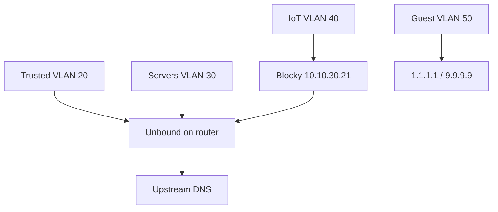

# VLAN plan

IP addressing, DHCP pools, IPv6 layout, and DNS policy. Firewall rules:
[firewall-matrix.md](firewall-matrix.md). Device list:
[inventory.md](inventory.md).

## VLAN table

| VLAN ID | Name    | IPv4 subnet     | Gateway      | Purpose                    |
| ------- | ------- | --------------- | ------------ | -------------------------- |
| 10      | mgmt    | `10.10.10.0/24` | `10.10.10.1` | Switch/AP/BMC management   |
| 20      | trusted | `10.10.20.0/24` | `10.10.20.1` | User devices (SSID `Hai-Fi Wai-Fi`) |
| 30      | servers | `10.10.30.0/24` | `10.10.30.1` | Homelab, TrueNAS, k8s      |
| 40      | iot     | `10.10.40.0/24` | `10.10.40.1` | IoT devices (SSID `Hai-Fi Wai-Fi (IoT)`) |
| 50      | guest   | `10.10.50.0/24` | `10.10.50.1` | Visitors (SSID `Hai-Fi Wai-Fi (Guest)`) |

**Rejected:** VLAN 99 wan-bridge — not needed with dedicated WAN NIC.

## Static IP allocations (VLAN 30)

| IP                 | Host         | Role                                                                |
| ------------------ | ------------ | ------------------------------------------------------------------- |
| `10.10.30.10`      | _(reserved)_ | k8s API VIP — reserved for future kube-vip; API at `nordri` `.11:6443` |
| `10.10.30.11`      | nordri       | k3s control plane                                                   |
| `10.10.30.12`      | sudri        | k3s worker                                                          |
| `10.10.30.13`      | austri       | k3s worker                                                          |
| `10.10.30.14`      | vestri       | k3s worker                                                          |
| `10.10.30.15`      | zpi          | Audio casting (RPi 5); MAC `d8:3a:dd:cf:e1:75`                      |
| `10.10.30.20`      | truenas      | HA, Forgejo, Authelia, Blocky                                       |
| `10.10.30.21`      | blocky       | IoT DNS filter (TrueNAS Docker)                                     |
| `10.10.30.100`     | traefik-lb   | Traefik LoadBalancer (MetalLB)                                      |
| `10.10.30.101`     | loki         | Loki push API (MetalLB) — Promtail stub; **no Authelia**            |
| `10.10.30.102–110` | —            | MetalLB pool spare                                                  |

## Static IP allocations (VLAN 10)

| IP            | Host   | Role                         |
| ------------- | ------ | ---------------------------- |
| `10.10.10.1`  | janus  | Mgmt gateway                 |
| `10.10.10.2`  | crs310 | CRS310 CPU (RouterOS), **IPv4 only** |
| `10.10.10.3`  | usw-nc | UniFi Flex Mini (network closet); MAC `f4:e2:c6:55:40:ab` |
| `10.10.10.4`  | usw-lr | UniFi Flex Mini (living room); MAC `d0:21:f9:b2:bf:5d` |
| DHCP `.100–.200` | U7 Lite | AP mgmt; MAC `a8:9c:6c:b8:f6:27` — no reservation |
| DHCP `.100–.200` | Turing Pi BMC | Mgmt NIC — no reservation until MAC known |

## DHCP pools (dnsmasq on router)

| VLAN       | Pool        | Lease time               |
| ---------- | ----------- | ------------------------ |
| 10 mgmt    | `.100–.200` | 24 h                     |
| 20 trusted | `.100–.250` | 24 h                     |
| 30 servers | `.22–.50`   | 24 h (most hosts static) |
| 40 iot     | `.100–.250` | 1 h                      |
| 50 guest   | `.100–.250` | 1 h                      |

**DHCP options:** push Unbound (`10.10.x.1`) as DNS; domain `lab.zdk.no` (search).
**Exceptions:** guest → `1.1.1.1` / `9.9.9.9`. IoT → Unbound on `10.10.40.1` until Stage 4, then Blocky `10.10.30.21` (`homelab.router.enableBlocky`) and **no** `domain-search`.

## WiFi mapping (UniFi OS Server on router)

| SSID                    | VLAN | Isolation                  |
| ----------------------- | ---- | -------------------------- |
| `Hai-Fi Wai-Fi`         | 20   | WPA3 where supported       |
| `Hai-Fi Wai-Fi (IoT)`   | 40   | 2.4 GHz for legacy devices |
| `Hai-Fi Wai-Fi (Guest)` | 50   | Client isolation ON        |

Caddy A records (`*.lab.zdk.no` → `10.10.30.1`) are independent of Inform.
Inform Host Override is **`10.10.10.1`** because the AP and Flex Minis use untagged VLAN 10.
`unifi.lab.zdk.no` is a **single** A record at Caddy (`.30.1`); no extra views
on mgmt/trusted. Until a Caddy vhost exists, browse `https://10.10.10.1:11443`.
Leave Caddy on `.30.1` so mgmt DNS stays infrastructure-only.

## Switch ports (CRS310)

| Port | Mode   | VLAN | Device                 |
| ---- | ------ | ---- | ---------------------- |
| 1    | tagged trunk | 10,20,30,40,50 | OptiPlex i350 (janus) |
| 2    | native 10 + tagged 20,40,50 | mgmt + SSIDs | Ubiquiti U7 Lite (`a8:9c:6c:b8:f6:27`) |
| 3    | access | 30   | Turing Pi 2.5          |
| 4    | access | 30   | TrueNAS                |
| 5    | access | 30   | Zpi (RPi 5)            |
| 6    | native 10 + tagged 20,40 | mgmt + trusted + iot | USW-NC port 4 |
| 7–8  | disabled | — | unused                 |
| 9–10 | disabled | — | SFP+ unused            |

Config: [switch/crs310.rsc](../switch/crs310.rsc). CRS310 mgmt: `10.10.10.2` (`crs310.lab.zdk.no`). Trusted (`10.10.20.0/24`) may reach that address (SSH/Winbox); other mgmt hosts stay VLAN-10-only. UniFi devices (AP + Flex Minis) use native VLAN 10 so Inform is `10.10.10.1` (not Caddy at `10.10.30.1`).

**USW Flex Mini VLAN limit:** these switches cannot use custom port profiles
(native + a tagged allow-list). That is a hardware limit, not a UI bug. Each
port is only **All** (native = UniFi **Default** network, every other network
tagged) or **one network untagged** (tagged blocked). Assign networks from
**Devices → switch → Ports**, not from Profiles.

UniFi **Default** must be VLAN 10 (mgmt) so **All** matches CRS310 ether6
(native 10). Do not keep a second network with VLAN ID 10. SSIDs stay on their
own networks (20/40/50). CRS310 still filters the uplink to tagged 20/40 only;
extra UniFi networks tagged by **All** simply have no path past ether6.

### USW-NC (network closet) — UniFi Flex Mini `10.10.10.3` (`f4:e2:c6:55:40:ab`)

| Port | UniFi assignment | Meaning | Device |
| ---- | ---------------- | ------- | ------ |
| 4    | **All** | native 10 + tagged rest | CRS310 ether6 |
| 2    | **All** | native 10 + tagged rest | USW-LR port 1 |
| 5    | network **trusted** (20) | access; tagged blocked | SW-O |
| 1, 3 | Disabled | unused | — |

Static `10.10.10.3/24`, gateway/DNS `10.10.10.1`. Management follows **All**
(Default / VLAN 10). Do not set a custom management VLAN that differs from Default.

### USW-LR (living room) — UniFi Flex Mini `10.10.10.4` (`d0:21:f9:b2:bf:5d`)

| Port | UniFi assignment | Meaning | Device |
| ---- | ---------------- | ------- | ------ |
| 1    | **All** | native 10 + tagged rest | USW-NC port 2 |
| 2–5  | network **iot** (40) | access; tagged blocked | Hue (`ec:b5:fa:12:d3:7c`), Trådfri (`68:ec:8a:02:69:43`), spare |

Static `10.10.10.4/24`, gateway/DNS `10.10.10.1`.

### SW-O (office) — unmanaged

No 802.1Q. Every port is VLAN 20 because USW-NC port 5 is access 20. **pingu** (`f0:2f:74:dd:e6:48`) and **Peon** (work machine) live here. Do not hang IoT or mgmt devices off SW-O.

## Router cabling

| NIC                | MAC                 | Name     | Role                          |
| ------------------ | ------------------- | -------- | ----------------------------- |
| Onboard **I217LM** | `34:17:eb:96:84:20` | `wan0`   | WAN — ISP modem (bridge mode) |
| **i350-T2** port 1 | `a0:36:9f:33:ae:96` | `lan0`   | 802.1Q trunk → CRS310         |
| **i350-T2** port 2 | `a0:36:9f:33:ae:97` | `spare0` | Unused (link forced down)     |

Port↔MAC for i350 assumed by ascending MAC; confirm with a cable test after first boot.

**Rejected alternative:** Router-on-a-stick (single NIC for WAN + trunk). See
[decisions.md](decisions.md).

## Inter-VLAN routing

- Routing **only on the NixOS router**; CRS310 is L2-only.
- No inter-VLAN routing on the switch.

## DNS architecture

**Stage 2–3 (before Blocky):** IoT DHCP DNS is Unbound on `10.10.40.1`. IoT can resolve `*.lab.zdk.no` during this window. Do not flip `enableBlocky` until Blocky answers on `.21`.

| Zone             | Resolver         | Policy                                                          |
| ---------------- | ---------------- | --------------------------------------------------------------- |
| Trusted, servers | Unbound (router) | Full split-horizon `*.lab.zdk.no`                               |
| IoT (Stage 2–3)  | Unbound `10.10.40.1` | Interim — lab names visible; no blocklists                   |
| IoT (Stage 4+)   | Blocky → Unbound | Blocklists; **deny** `*.lab.zdk.no` (whitelist exceptions only) |
| Guest            | Public resolvers | No internal names; restricted DNS possible later                |

### Split-horizon (Unbound)

| Name           | Internal answer       | WAN                                      |
| -------------- | --------------------- | ---------------------------------------- |
| `zdk.no`       | `10.10.30.1` (Caddy on janus) | Public `A`/`AAAA` via DDNS (vhost later) |
| `code.zdk.no`  | `10.10.30.1`                  | Public `A`/`AAAA` via DDNS (vhost later) |
| `img.zdk.no`   | `10.10.30.1`                  | Public `A`/`AAAA` via DDNS               |
| `ha.zdk.no`    | `10.10.30.1`                  | Public `A`/`AAAA` via DDNS               |
| `*.lab.zdk.no` | Host records, else Caddy on janus | **No public records**                |
| `lab.zdk.no`   | `10.10.30.1`                  | **No public record** (not WAN-reachable) |

Unbound `lab.zdk.no` is a **static** zone (no recursion to the internet). Exact `local-data` wins (`nordri`, `pingu`, `janus`, `headscale`, `immich`, …). `truenas.lab.zdk.no` and `unifi.lab.zdk.no` are Caddy (`10.10.30.1`), not the backend IPs — TrueNAS’s host firewall is same-subnet only. One-label names not listed (`grafana.lab.zdk.no`, `capacitor.lab.zdk.no`) hit a wildcard → Caddy on janus for HTTPS. Lab and public names use Caddy ACME **DNS-01** (Domeneshop); the `dns01` snippet queries `1.1.1.1`/`9.9.9.9` so certmagic does not ask this Unbound for NS of `zdk.no`. `domain-insecure` covers `lab.zdk.no` **and** `zdk.no` so local A records do not SERVFAIL if Domeneshop signs the public zone.

Authelia is **not** on `auth.lab.zdk.no` (portal), `code.lab.zdk.no` (Forgejo-native), `headscale.lab.zdk.no` (Tailscale login-server), `ha.lab.zdk.no` (HA-native), or `immich.lab.zdk.no` (Immich-native).

### Public DNS (Domeneshop + DNSUpdater)

| Record         | Type         | Updated by DDNS                      |
| -------------- | ------------ | ------------------------------------ |
| `@` (`zdk.no`) | `A` / `AAAA` | Yes (when Zdk ships)                 |
| `code`         | `A` / `AAAA` | Yes (when Forgejo WAN is enabled)    |
| `img`          | `A` / `AAAA` | Yes                                  |
| `ha`           | `A` / `AAAA` | Yes                                  |
| `lab`          | —            | **No** — internal split-horizon only |

## IPv6 (prefix delegation)

Enable on WAN at Stage 2. Document delegated prefix size from ISP logs here:

| Field                            | Value                           |
| -------------------------------- | ------------------------------- |
| Delegated prefix                 | `________________` (e.g. `/56`) |
| ISP                              | **OBOS Nett**                   |
| CGNAT                            | **Not active** (public IPv4)    |
| Router WAN IP matches whatismyip | Yes                             |
| Blocky GUA (`blockyIpv6`)        | `________________` (e.g. `<servers-/64>::21`) |

### Per-VLAN v6 (example from /56)

Carving uses the VLAN id as the subnet nibble. Replace `2a0x:yyyy` with the
real OBOS Nett prefix at Stage 2.

| VLAN / iface | IPv6 subnet (example) |
| ------------ | --------------------- |
| 10 mgmt      | `2a0x:yyyy:10::/64`   |
| 20 trusted   | `2a0x:yyyy:20::/64`   |
| 30 servers   | `2a0x:yyyy:30::/64`   |
| 40 iot       | `2a0x:yyyy:40::/64`   |
| 50 guest     | `2a0x:yyyy:50::/64`   |
| wg0          | `2a0x:yyyy:ff::/64`   |

**CRS310 CPU** stays IPv4-only (`/ipv6 settings set disable-ipv6=yes`). The
switch is L2: tagged IPv6 for clients still passes. Do not give the switch a
GUA until you have a reason to manage it over v6.

**Security:** WAN inbound v6 default deny. IoT/guest: internet egress only; no
cross-VLAN v6.

**Layout:** Native /64 per VLAN from delegated prefix (resolved). Document actual
prefix at Stage 2 — see [decision briefs](decision-briefs.md#1-ipv6-prefix-size).

## mDNS policy

1. **Prefer static IPs** in Home Assistant and casting rules — see
   [inventory.md](inventory.md).
2. **Cross-VLAN reflector (if needed):** Avahi on router, scoped **servers
   (VLAN 30) ↔ IoT (VLAN 40) only** — for HA discovery and casting. Never
   reflect to guest or trusted broadly.
3. **Trusted → IoT casting:** Prefer firewall allow rules to specific cast
   target IPs (TV, Chromecast, Odyssey) over wide mDNS reflection to trusted
   VLAN.
4. **Do not** move Home Assistant to IoT VLAN for discovery.

## WireGuard overlay

- Listen port: **`51820`/udp**
- VPN pool: `10.10.255.0/24` (`/32` per client)
- Routes: `10.10.0.0/16` (all lab VLANs)
- **IPv6:** VPN clients receive v6 routes to delegated lab subnets when v6 is
  enabled
- **Headscale:** on janus, **`127.0.0.1:8081`**, Caddy `headscale.lab.zdk.no`
  (no Authelia). UniFi Inform keeps `:8080`.
